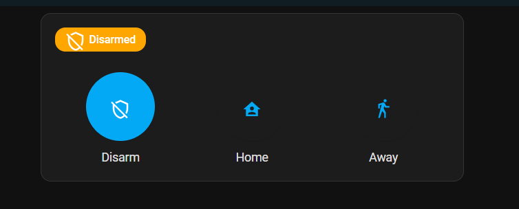
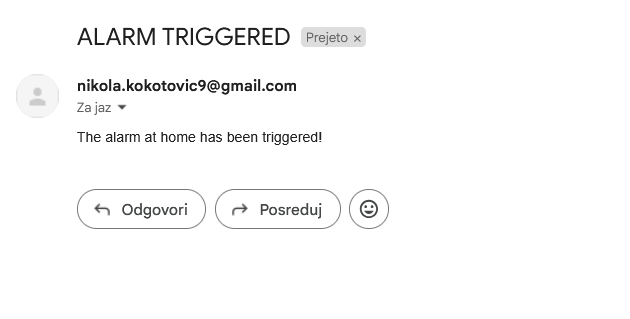
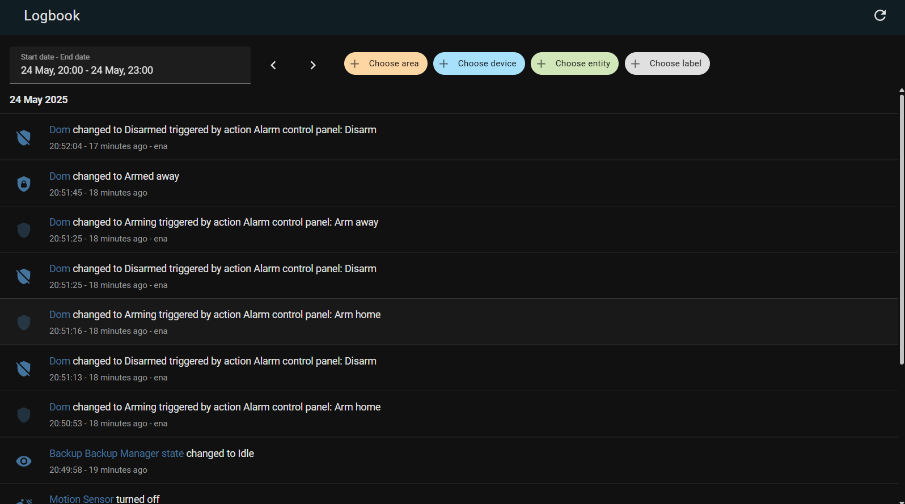
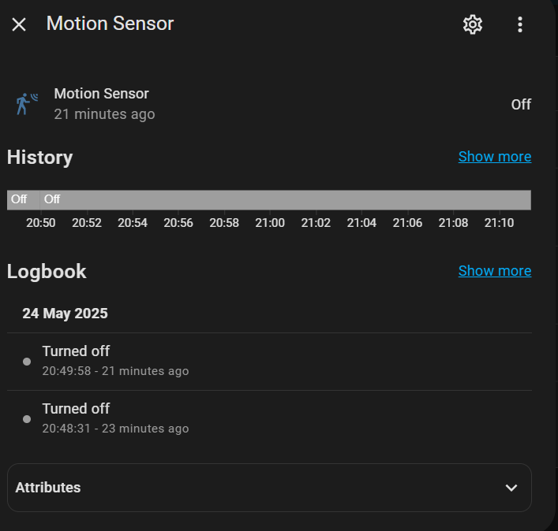
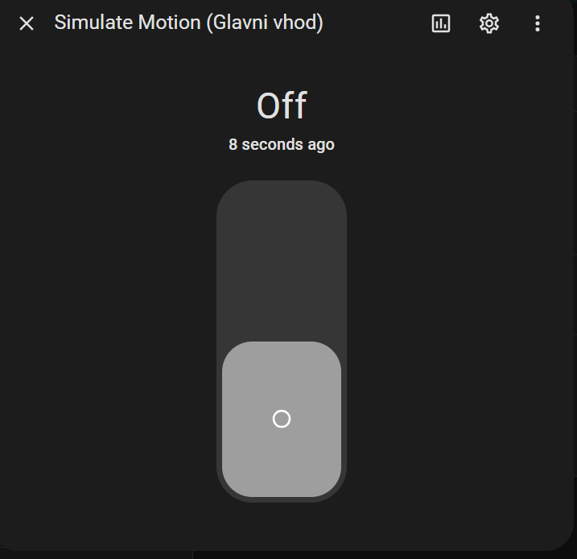
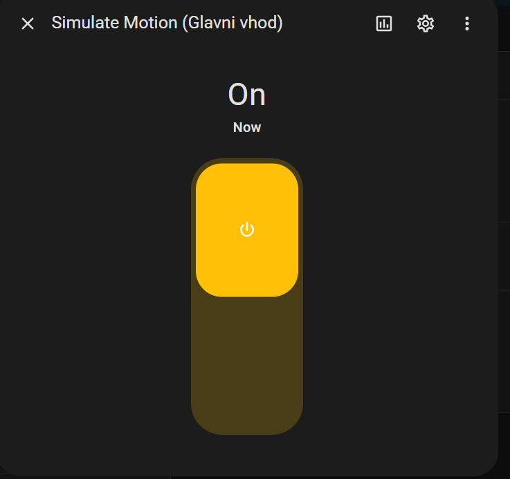
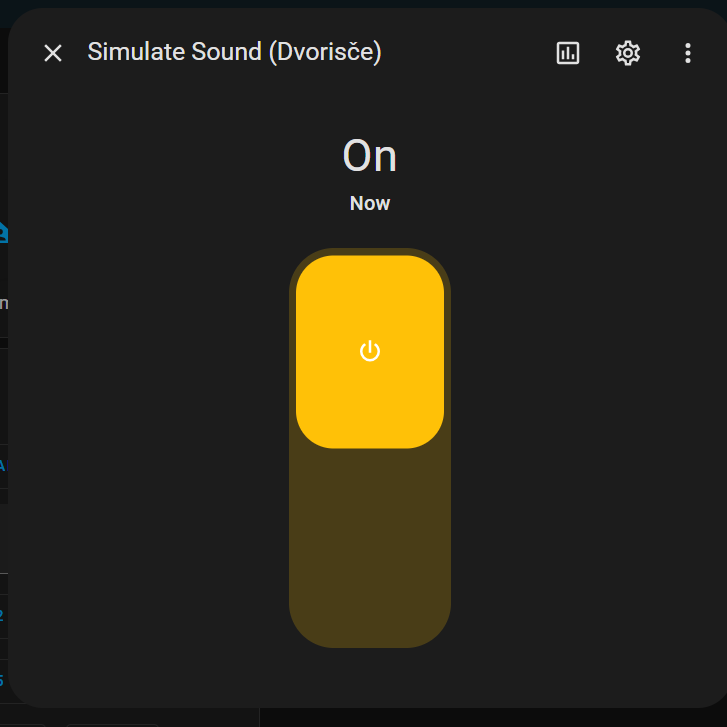

## 📃 Napredno upravljanje varnosti pametnega doma

## 💁  Skupina 19: Anej Tomplak, Enej Smole, Ena Zorič, Nikola Kokotović


## 1 Uvod

### Začetni odstavek

Projekt, ki smo ga razvili v okviru predmeta Tehnologija programske opreme, je napredni protivlomni varnostni sistem, namenjen predvsem pametnim domovom z osredotočenostjo na potrebe študentov in najemnikov. Gre za rešitev, ki omogoča uporabniku, da na preprost način sam vzpostavi nadzor nad varnostjo svojega doma brez pomoči varnostnih služb ali tehnično zahtevne namestitve. Motivacija za razvoj sistema izvira iz opažene potrebe po cenovno dostopni in hkrati zanesljivi zaščiti, ki bi bila prilagojena življenjskim razmeram študentov, kjer menjavanje prebivališč, sobivanja in daljša odsotnost pogosto predstavljajo varnostno tveganje.

Izvirnost naše rešitve se kaže predvsem v uporabi prepoznave obraza pri prijavi v sistem. Le registriran uporabnik, ki ga sistem prepozna po obrazu, ima dostop do funkcij izklopa senzorjev ali alarma. S tem smo rešili pomembno varnostno ranljivost – preprečili smo možnost, da bi nekdo z geslom ali fizičnim dostopom do naprave onemogočil sistem brez lastnikove vednosti. Poleg tega tak pristop omogoča višjo stopnjo zaščite pri vsakodnevni uporabi, saj ni odvisen le od gesla, temveč od biometrične identifikacije.

Za boljše razumevanje rešitve bralcu ponujamo pregled spletne aplikacije, ki je osrednje uporabniško orodje našega sistema. Prek nje lahko uporabnik aktivira ali deaktivira sistem, pregleduje zgodovino dogodkov, upravlja z načini varovanja (doma, odsoten, izklopljen), in to vse od kjerkoli – preko brskalnika na računalniku ali telefonu. S tem projekt ne ponuja le tehnično napredne rešitve, ampak tudi uporabniško izkušnjo, ki je enostavna, varna in prilagodljiva.V

### 1.1 Izzivi

Glavni izzivi, s katerimi se je ekipa soočila pri razvoju protivlomnega varnostnega sistema, so bili povezani predvsem z vzpostavitvijo okolja Home Assistant. Home Assistant je zaradi svoje kompleksnosti in občasno nejasne dokumentacije zahteval precej več časa, kot smo sprva načrtovali. Da bi te izzive premagali, smo si zavestno vzeli dodatne dneve za podrobno spoznavanje platforme, iskanje rešitev v skupnosti ter testiranje različnih pristopov vzpostavitve okolja, vključno z alternativami za docker integracijo. Podobno smo se osredotočeno lotili tudi komunikacijskih poti med programskimi komponentami.. Tehnologije, kot so Python in SQLite so bile nekaterim članom že delno znane, medtem ko so bili Home Assistant in Scrum metodologija za večino novost.

### 1.2 Poudarki

V okviru projekta smo uspešno razvili delujoč prototip pametnega protivlomnega varnostnega sistema, ki vključuje ključne funkcionalnosti za zaznavanje gibanja, zvoka, upravljanje varnostnih načinov in obveščanje uporabnika. Uspeli smo implementirati spletno aplikacijo, preko katere lahko uporabnik varno dostopa do sistema, spreminja nastavitve, pregleda zgodovino dogodkov, deaktivira alarm in simulira dodgodke na senzorjih – vse to tudi z uporabo obrazne prepoznave kot dodatne varnostne zaščite. Prav tako smo povezali Home Assistant s senzorskim sistemom in podatkovno bazo ter vzpostavili mehanizme za pošiljanje opozoril v primeru zaznanih groženj. Sistem temelji na spletni povezavi, zato smo se posebej posvetili stabilnosti komunikacije med komponentami, kar zagotavlja zanesljivo in tekoče delovanje v realnem času.

### 1.3 Spremembe

Glavne spremembe našega projekta so naslednje:  

**Opustitev Android aplikacije in prehod na spletno aplikacijo:**
Razvoj mobilne aplikacije za Android smo opustili in se v celoti osredotočili na spletno aplikacijo. Ta pristop nam je omogočil hitrejši razvoj, boljšo preglednost kode in enotno uporabniško izkušnjo, saj lahko do sistema dostopa vsak uporabnik preko brskalnika, ne glede na napravo. Hkrati smo ugotovili da obstaja Home Assistant aplikacija za Android, katero lahko uporabljamo.

**Prenova uporabniških zgodb:**
Prvotne zgodbe so bile preveč splošne in nepovezane s funkcionalnimi zahtevami, zato smo jih prenovili. Dodali smo konkretne scenarije in jasne teste sprejemljivosti, kar je omogočilo boljše načrtovanje in testiranje funkcionalnosti.

**Odstranitev funkcionalnosti ročnega preizkusa sistema:**
Ugotovili smo, da bi implementacija funkcije ročnega preizkusa zahtevala nesorazmerno veliko dela glede na njeno uporabno vrednost. Zato smo jo odstranili in se namesto tega osredotočili na izboljšanje zaznave dogodkov ter stabilnosti obstoječih funkcij.

| Datum     | Opis                        | Motivacija                                                                                 | Posledica spremembe                                                                                                  |
|-----------|-----------------------------|---------------------------------------------------------------------------------------------|----------------------------------------------------------------------------------------------------------------------|
| 24.3.2025 | Popravljen opis projekta     | Po prvotnem opisu so nekateri deli projekta delovali preveč splošno ali nedosledno povezani z glavno idejo. Da bi izboljšali razumevanje ciljev in strukture projekta, smo se odločili za prenovo uvodnega opisa ter jasnejše definiranje osnovnega koncepta in pristopa. | Opis projekta je zdaj strukturiran in usklajen z ostalimi deli dokumentacije, kar omogoča boljšo usklajenost članov ekipe in lažje razumevanje projekta za zunanje bralce. |
| 28.3.2025 | Popravljene uporabniške zgodbe | Prvotne uporabniške zgodbe so bile ponekod nepopolne, preveč splošne ali nedovolj povezane s cilji uporabnikov. Zaradi tega ni bilo jasno, kako sistem neposredno odgovarja na potrebe uporabnikov. Popravili smo jih tako, da so bolj realistične in vsebujejo več testov sprejemljivosti. | Izboljšane zgodbe omogočajo boljše načrtovanje funkcionalnosti in testov, hkrati pa pomagajo razumeti konkretne potrebe uporabnikov in kako jih bomo naslovili v sistemu. |
| 28.3.2025 | Popravljena tveganja          | Pri analizi tveganj smo ugotovili, da so bila nekatera tveganja opisana preveč površinsko ali premalo jasno kategorizirana. Da bi zagotovili učinkovitejše upravljanje tveganj, smo jih natančneje razčlenili, jim dodali oceno vpliva in verjetnosti, ter jih razvrstili glede na stopnjo resnosti. | Prenovljena tabela tveganj omogoča boljšo pripravo na možne zaplete pri izvedbi projekta, saj jasno pokaže, katera tveganja so najbolj kritična in katera strategija jih lahko reši. |
| 8.4.2025 | Izključitev android aplikacije iz načrta | Ugotovili smo, da je android aplikacija nekoliko nesmiselna, zato smo se odločili, ker bomo identifikacijo obraza implementirali direktno v spletno aplikacijo, kar je bil glavni razlog, da smo želeli implementirati android aplikacijo. | Identifikacija obraza se bo izvajala v spletni aplikaciji.
| 8.4.2025 | Odprava administratorske uporabniške vloge | Ker bo spletna aplikacija omogočala registracijo, kjer bo uporabnik določil svoje uporabniško ime in geslo, torej ne potrebujemo administratorja, ki bo dodajal/brisal uprabnike. | Uporabniška vloga ne vključuje administratorja. Spremenjen use case diagram.
| 8.4.2025 | Odstranitev funkcionalnosti ročnega preizkusa sistema | Poenostavitev sistema in zmanjšanje kompleksnosti. Funkcionalnost ročnega testiranja ni predstavljala ključne dodane vrednosti za uporabnika. | Use case "Ročni preizkus sistema" je bil odstranjen. Posodobljen use case diagram in ustrezni sprejemni testi. |
| 27.4.2025 | Odstranitev funkcionalnosti ročnega preizkusa sistema | Poenostavitev sistema in zmanjšanje kompleksnosti. Funkcionalnost ročnega testiranja ni predstavljala ključne dodane vrednosti za uporabnika. | Use case "Ročni preizkus sistema" je bil odstranjen. Posodobljen use case diagram in ustrezni sprejemni testi. |  
| 15.5.2025 | Dodani načrtovalski vzorci v dokumentacijo | V prvi različici dokumentacije načrtovalski vzorci niso bili vključeni, čeprav smo jih v implementaciji uporabljali. Ker so manjkali, smo jih naknadno opisali za boljšo tehnično preglednost projekta. | V dokumentacijo smo dodali njihov opis in primer njihove uporabe v našem sistemu. |
| 27.5.2025 | Posodobitev diagramov glede na končno stanje | Po zaključku razvoja smo ugotovili, da so se nekatere funkcionalnosti in arhitekturne rešitve spremenile glede na začetne načrte. Da bi zagotovili usklajenost dokumentacije s končnim izdelkom, smo posodobili vse UML diagrame (razredni, zaporedni, arhitekturni, procesni, fizični) in use-case diagram, da odražajo dejansko implementirane funkcionalnosti in strukturo sistema. | Diagrami zdaj natančno prikazujejo končno stanje sistema, kar omogoča boljše razumevanje arhitekture in olajša nadaljnji razvoj ali vzdrževanje. |

## 2 Potrebe naročnika

**Primarni deležniki:** nosilci predmeta TPO, ki projekt vodijo in ocenjujejo. Njihova pričakovanja so:

 - Želijo videti inovativne rešitve s področja varnosti pametnih domov.

 - Pričakujejo uporabo sodobnih tehnologij

 - Pomembna je usklajenost z zahtevami naloge

 - Sistem mora biti delujoč prototip z realnimi ali simuliranimi podatki.


**Sekundarni deležniki:** splošni uporabniki pametnih domov, torej posamezniki in družine, ki bi tak sistem uporabljali v realnem življenju. Njihova pričakovanja so:

 - Enostavna uporaba: Sistem mora biti intuitiven in nezahteven za nastavitev.

 - Zanesljivost: Uporabniki želijo natančno zaznavanje nevarnosti in minimalno število lažnih alarmov.

 - Prilagodljivost: Sistem naj omogoča različne varnostne načine (doma, odsotnost, izklopljen).

 - Takojšnje obveščanje: Želijo takojšnja opozorila prek e-pošte.

 - Varnost in zasebnost: Ključno je varno shranjevanje podatkov in zaščita pred zlorabami.

Splošna želena izkušnja uporabnikov je sistem, ki ne zahteva stalnega ročnega upravljanja – varnostna pravila se prilagajajo avtomatsko. Nudi občutek varnosti, ne da bi bil vsiljiv ali moteč. Omogoča hitro ukrepanje v primeru zaznane grožnje. Je združljiv z obstoječimi pametnimi napravami in enostaven za integracijo.

Nosilci predmeta pa pričakujejo, da bo projekt tehnično dovršen, inovativen in dobro dokumentiran.

### 2.1 Uporabniške zahteve


### Uporabniška zgodba 1
**Kot lastnik pametnega doma želim, da sistem zazna nenavadne aktivnosti (gibanje, neznane osebe), da lahko hitro ukrepam v primeru potencialne grožnje.**

**Testi sprejemljivosti:**
- Ko je prostor označen kot prazen in sistem zazna gibanje, uporabnik prejme varnostno opozorilo.
- Če uporabnik potrdi, da gre za lažni alarm, sistem to zabeleži in naslednjič ne sproži opozorila za isti vzorec.
- Sistem zazna zaporedne sumljive dogodke in jih prikaže kot povezan incident z opozorilom o ponavljanju.
- Uporabnik lahko v aplikaciji označi dogodek kot “nujno preveriti”, kar sproži dodatno opozorilo.

### Uporabniška zgodba 2
**Kot lastnik pametnega doma želim, da sistem samodejno prilagodi varnostni način (doma, odsotnost, izklopljen), da mi ni treba ročno spreminjati nastavitev.**

**Testi sprejemljivosti:**
- Ko uporabnik ročno nastavi način "odsotnost", se aktivirajo vsi senzorji in začne beleženje dogodkov.
- Če sistem zazna, da se je uporabnik vrnil domov, samodejno preklopi način na "doma".
- Če se zazna aktivnost, ki ne ustreza trenutnemu načinu, se uporabniku ponudi možnost ročne spremembe.
- V nastavitvah lahko uporabnik določi časovna pravila za samodejni preklop načinov.
- Če pride do napake pri zaznavi konteksta, se uporabniku izpiše opozorilo in predlog za nastavitev izjeme.

### Uporabniška zgodba 3
**Kot uporabnik želim imeti dostop do zgodovine zaznanih dogodkov, da lahko preverim pretekle varnostne incidente.**

**Testi sprejemljivosti:**
- Ko uporabnik odpre zgodovino dogodkov, vidi seznam incidentov s časovnimi žigi in opisi.
- Dogodke lahko razvrsti po času, vrsti dogodka ali lokaciji senzorja.
- Če klikne na dogodek, se prikaže podrobnejši vpogled.

### Uporabniška zgodba 4
**Kot uporabnik želim, da se v aplikacijo lahko prijavim s prepoznavo obraza, da bo prijava hitrejša in varnejša.**

**Testi sprejemljivosti:**
- Ko uporabnik izbere prijavo z obrazom, sistem preveri skladnost in omogoči dostop.
- Če prepoznavanje ne uspe več kot trikrat, se omogoči prijava z geslom.
- Ob neuspešnem prepoznavanju se pošlje opozorilo in zabeleži incident.


### Uporabniška zgodba 5
**Kot uporabnik želim možnost prijave v aplikacijo z e-poštnim naslovom in geslom, da imam alternativen način dostopa.**

**Testi sprejemljivosti:**
- Ob pravilnem vnosu sistem omogoči dostop.
- Ob več napačnih poskusih sistem zaklene račun in pošlje opozorilo.
- Uporabnik lahko geslo spremeni v nastavitvah.
- Sistem beleži neuspele prijave.

### Uporabniška zgodba 6
**Kot uporabnik želim, da me aplikacija po e-pošti obvesti, če sistem zazna vlom, da sem lahko takoj obveščen.**

**Testi sprejemljivosti:**
- Ob zaznavi vloma se pošlje e-poštno opozorilo s podrobnostmi.
- Če sporočilo ni odprto v določenem času, se pošlje opomnik.

### Uporabniška zgodba 7
**Kot uporabnik želim, da sistem v načinu "away" aktivno spremlja gibanje in me obvesti, če zazna nepredvideno gibanje.**

**Testi sprejemljivosti:**
- Zaznano gibanje sproži obvestilo.
- Če ni potrjeno, se pošlje tudi e-pošta.
- Preverjanje znanih oseb zmanjša lažne alarme.

### Uporabniška zgodba 8
**Kot uporabnik želim, da sistem v načinu "home" pasivno spremlja dogajanje in ne sproži alarma, razen ob zaznavi nenavadne aktivnosti.**

**Testi sprejemljivosti:**
- Običajno gibanje ne sproži alarma.
- Nenavadno gibanje sproži obvestilo.
- Možnost ogleda žive slike in ročne sprožitve alarma.
- Dogodki se zabeležijo kljub neaktivnemu alarmu.


### Uporabniška zgodba 9
**Kot uporabnik želim, da lahko dodajam in odstranjujem senzorje v sistemu.**

**Testi sprejemljivosti:**
- Novi senzor se pojavi in začne delovati.
- Napačna konfiguracija sproži napako.
- Odstranjen senzor izgine iz sistema.
- Zgodovina beleži spremembe.

### Uporabniška zgodba 10
**Kot uporabnik želim, da se alarm samodejno sproži ob nepooblaščenem vstopu.**

**Testi sprejemljivosti:**
- Gibanje sproži alarm.
- Uporabnik prejme obvestilo s podrobnostmi.
- Dogodek se shrani z vsemi podatki.


Naročnik si želi pametni varnostni sistem, ki bo uporabniku omogočal popoln nadzor nad varnostjo doma, z minimalnim vložkom napora in brez potrebe po zunanjih varnostnih službah. Pričakuje rešitev, ki bo delovala zanesljivo, samodejno prilagajala varnostne nastavitve glede na kontekst uporabe (doma, odsotnost, izklop), ter omogočala hitro in pregledno obveščanje o zaznanih varnostnih incidentih. Pomembno je, da sistem zagotavlja visoko raven zasebnosti in varnosti podatkov, vključno z lokalno obdelavo informacij in možnostjo avtentikacije z obraznim prepoznavanjem. <br> Želja naročnika je, da je sistem modularen, enostaven za namestitev ter uporaben tudi za najemnike ali druge gospodinjstva brez tehničnega predznanja. Poudarek je na uporabniški izkušnji, kar pomeni, da rabi biti sistem intuitiven, odziven in enostaven za integracijo z obstoječimi pametnimi napravami. 


### 2.1 Skupine nefunkcionalnih zahtev (strukturiran prikaz)

- **Nefunkcionalne zahteve**
  - **Zahteve izdelka**
    - Zahteve učinkovitosti
      - Zahteve uporabnosti
        - Intuitivnost vmesnika
        - Prilagodljivost obveščanja
        - Odzivnost vmesnika
      - Hitrost odziva
    - Zahteve zanesljivosti
      - Zanesljivost zaznavanja
      - Razpoložljivost (24/7)
    - Prostorske zahteve *(če dodate npr. o omejitvah prostora senzorjev)*
    - Varnostne zahteve
      - Varnost prijave (geslo, 2FA, obraz)
      - Dnevniška evidenca
      - Uporabniške pravice
  - **Organizacijske zahteve**
    - Zahteve okolja
      - Razvojno okolje (Home Assistant, Python, SQLite)
    - Operativne zahteve
      - Uporaba Git repozitorija
      - Dokumentacija
    - Razvojne zahteve
      - Scrum, iteracije, testiranje
      - Dodeljevanje vlog in nalog
  - **Zunanje zahteve**
    - Zakonske zahteve
      - Skladnost z GDPR
    - Etične zahteve
      - Lokalna obdelava podatkov
      - Privolitev za obdelavo obraza
    - Varnostne zahteve
    - Dostopnost
      - Podpora za tehnično manj vešče uporabnike


Nefunkcionalne zahteve projekta varnostnega sistema za pametne domove lahko razdelimo v tri glavne skupine:

####  Zahteve izdelka

Te zahteve določajo lastnosti, ki jih mora imeti končni izdelek z vidika delovanja, uporabnosti in kakovosti:

1. **Zanesljivost**: Sistem mora pravilno zaznati vsaj 95 % varnostnih dogodkov, z manj kot 5 % lažnih alarmov.

2. **Hitrost odziva**: Ob zaznavi varnostne grožnje mora sistem uporabniku poslati opozorilo v manj kot 5 sekundah.

3. **Uporabnost**: Vmesnik mora biti intuitiven in enostaven za uporabo – vsaj 90 % uporabnikov mora oceniti sistem kot uporabniku prijazen.

4. **Razširljivost**: Uporabnik mora imeti možnost samostojno dodajati ali odstranjevati senzorje in module brez potrebe po tehnični pomoči.

5. **Varnost prijave**: Sistem mora podpirati vsaj dve od naslednjih metod prijave: geslo, dvostopenjska avtentikacija ali prepoznavanje obraza.

6. **Razpoložljivost**: Sistem mora delovati 24/7 brez prekinitve, tudi ob občasni nedostopnosti interneta (lokalno shranjevanje dogodkov).

7. **Odzivnost vmesnika**: Vmesnik (mobilna ali spletna aplikacija) se mora naložiti in odzvati v manj kot 2 sekundah pri običajni povezavi.

8. **Prilagodljivost obveščanja**: Uporabnik mora imeti možnost izbire med več obveščevalnimi kanali (mobilna aplikacija, e-pošta, glasovni asistent).

9. **Dnevniška evidenca**: Sistem mora hraniti časovno označeno evidenco vseh dogodkov in uporabniških dejanj za kasnejši pregled ali analizo.


####  Organizacijske zahteve

Te zahteve izhajajo iz načina razvoja in uporabljenih tehnologij v ekipi:

1. **Standardi**: Uporaba dobrih praks razvoja z uporabo Git repozitorija (npr. GitHub), z dokumentiranjem sprememb.

2. **Razvojno okolje**: Sistem mora biti zasnovan z uporabo odprtokodne platforme Home Assistant, jezika Python, orodij za Android razvoj ter SQLite za shranjevanje podatkov.

3. **Testiranje**: Implementacija avtomatskih in ročnih testov mora biti vključena v vsako iteracijo projekta.

4. **Sodelovanje v ekipi**: Razvoj mora potekati po načelih agilnega razvoja (Scrum), z delitvijo dela med člane in sprotnim usklajevanjem.

####  Zunanje zahteve

Zahteve, ki jih določajo zunanji dejavniki:

1. **Zakonodaja**: Sistem mora biti skladen z zakonodajo EU glede varovanja osebnih podatkov (GDPR), zlasti pri obdelavi slik in zaznav obraza.

2. **Etika**: Podatki uporabnikov se ne smejo pošiljati v oblak brez njihove privolitve; sistem mora omogočati delovanje tudi brez interneta.

3. **Dostopnost**: Uporaba mora biti omogočena tudi za tehnično manj vešče uporabnike, kot so starejši ali otroci.


## 3 Cilji projekta


Projekt naslavlja naročnikove težave pri upravljanju varnostnega sistema in zagotavljanju hitrih obvestil v primeru zaznanih varnostnih incidentov. Cilj sistema je povečati varnost uporabnikov, omogočiti enostavno upravljanje ter zagotoviti zanesljivo obveščanje.

Koristi projekta:

Povečana varnost – Sistem omogoča hitrejše odzivanje na sumljive dogodke.

Udobje – Uporabnik lahko varnostni sistem upravlja preko mobilne ali spletne aplikacije.

Zanesljivost – Centralno vozlišče skrbi za neprekinjeno delovanje sistema.

Avtomatizacija – Samodejno upravljanje sistema glede na uporabnikove nastavitve.

### 3.1 Slovar pojmov

 - Spletna aplikacija – Python program, ki nadzira delovanje varnostnega sistema in komunicira s senzorji, alarmom in home assistant-om.

 - Uporabnik – Oseba, ki uporablja varnostni sistem.

 - Senzor gibanja – Naprava, ki zazna gibanje v prostoru in pošlje signal spletni aplikaciji.

 - Senzor zvoka - Naprava, ki zazna zvok v prostoru in pošlje signal spletni aplikaciji

 - Identifikacija obraza – Biometrična metoda preverjanja uporabnikove identitete.

 - Varnostna koda – Geslo, ki ga uporabnik vnese za izklop sistema.

 - Alarm – Signalna naprava, ki se sproži ob nepooblaščenem vstopu.

 - Obvestilo – Sporočilo, poslano uporabniku preko e-maila in vidno na spletni aplikaciji.
  
 - Način varovanja Doma – Sistem je vklopljen, vendar so nekateri senzorji izključeni (npr. notranji senzorji).

 - Način varovanja Odsoten – Sistem je v celoti vklopljen, vsi senzorji so aktivni.

 - Način varovanja Izklop – Sistem ne nadzoruje objekta, senzorji so izključeni.


### 3.2 Uporabniške vloge

Navaden uporabnik – Lahko vklopi/izklopi sistem ter prejema obvestila o zaznanem gibanju.

### 3.3 Primeri uporabe

---


1. **Prijava v Spletno aplikacijo** 

Cilj uporabnika: Uporabnik želi dostopati do varnostnega sistema preko spletne aplikacije.

Osnovni tok:

  1. Uporabnik odpre spletno aplikacijo.

  2. Sistem zahteva prijavo z vnosom uporabniškega imena in gesla

  3. Uporabnik uspešno opravi prijavo.

  4. Prikaže se glavni meni aplikacije.

Alternativni tok:

 - Neuspešna prijava - Če geslo koda ni ppravilnoravilna, sistem zavrne dostop in omogoči ponovni poskus. 

Stopnja prioritete: must have

---


2. **Deaktivacija varnostnega sistema preko spletne aplikacije**

Cilj uporabnika: Uporabnik želi deaktivirati varnostni sistem pred vstopom v objekt preko spletne aplikacije.

Osnovni tok:  

  1. Uporabnik odpre spletno aplikacijo.

  2. Izbere možnost „Izklopi alarm“.

  3. Spletna aplikacija potrdi aktivacijo sistema in posodobi nastavitve v home assistant-u.
   
  4. Uporabnik prejme potrditev o uspešnem izklopu.

Alternativni tok:

 - Neuspešna prijava - Če varnostna koda ni pravilno, sistem zavrne dostop in omogoči ponovni poskus.

Stopnja prioritete: must have

---

3. **Detekcija gibanja ali zvoka in sprožitev alarma**

Cilj uporabnika: Sistem zazna gibanje ali zvok in začne postopek sprožitve alarma.

Osnovni tok:

  1. Senzor zazna gibanje ali zvok.

  2. Sistem prične odštevati 1 minuto.

  3. Če uporabnik ne deaktivira alarma, se alarm sproži.

  4. Pokliče se Pošiljanje obvestil in pošlje uporabniku obvestilo o sprožitvi alarma (include).

Alternativni tok:

 - Preklic alarma – Uporabnik preko spletne aplikacije izvede deaktivacijo in prekliče alarm.

Stopnja prioritete: must have

---

4. **Spreminjanje nastavitev načina varovanja preko spletne aplikacije**
    
Cilj uporabnika: Uporabnik želi spremeniti način varovanja (Doma, Odsoten, Izklop) v spletni aplikaciji.

Osnovni tok:

  1. Uporabnik odpre spletno aplikacijo.

  2. Izbere možnost "Nastavitve varovanja".

  3. Izbere želeni način varovanja (Doma, Odsoten, Izklop).

  4. Spletna aplikacija potrdi spremembo načina varovanja in posodobi nastavitve v home assistant-u.

  5. Uporabnik prejme potrditev o uspešni spremembi.

Alternativni tok:

 - Neuspešna sprememba – Če ni internetne povezave, sistem prikaže obvestilo o napaki.

Stopnja prioritete: must have

---


5.  **Pregled zgodovine dogodkov**
    
Cilj: Uporabnik želi preveriti zgodovino dogodkov v sistemu.

Osnovni tok:

  1. Uporabnik odpre aplikacijo (spletno stran).

  2. Izbere možnost "Logbook".

  3. Pregleda seznam vseh dogodkov (prijave, sproženi alarmi, spremembe nastavitev itd.).

Alternativni tok:

– Ni alternativnega toka; funkcija je dostopna vsem prijavljenim uporabnikom.

Stopnja prioritete: should have


---


### 3.4 Sprejemni testi


| #  | Testirana funkcija              | Začetno stanje                              | Vhod                              | Pričakovan rezultat                                |
|----|----------------------------------|---------------------------------------------|-----------------------------------|-----------------------------------------------------|
| 1  | Prijava v spletno aplikacijo     | Brskalnik odprt, uporabnik ni prijavljen    | Pravilno geslo                    | Uspešna prijava, prikaz glavnega menija            |
| 2  | Prijava v spletno aplikacijo     | Brskalnik odprt, uporabnik ni prijavljen    | Prazna polja                      | Sporočilo o manjkajočih podatkih                   |
| 3  | Detekcija gibanja ali zvoka      | Sistem aktiviran v načinu "Odsoten"         | Gibanje pred senzorjem ali zvok  | Obvestilo uporabniku, 1-minutni odštevalnik        |
| 4  | Sprožitev alarma                 | Detekcija gibanja ali zvoka, 1 minuta brez odziva | -                          | Alarm se sproži, obvestilo uporabniku              |
| 5  | Sprememba načina varovanja       | Uporabnik prijavljen                         | Izbira "Izklop"                   | Potrditev spremembe, sistem deaktiviran            |
| 6  | Zgodovina dogodkov               | Uporabnik prijavljen                         | Klik na "Logbook"      | Prikaz zgodovine vseh dogodkov                     |


**diagram primerov uporabe** ([Use Case Diagram](https://plantuml.com/use-case-diagram), izvorna koda :bar_chart: [PlantUML](./gradivo/plantuml/DPU.puml))

  


### 3.5 Merila uspeha

Naročnik je zadovoljen, če:

-  Sistem deluje kot delujoč prototip, bodisi z realnimi senzorji ali simuliranimi podatki.
-  Avtomatizacije (alarm, prepoznavanje obraza, zaznava gibanja) delujejo zanesljivo.
-  Uporabniški vmesnik omogoča enostavno prijavo, upravljanje varnostnih načinov in vpogled v zgodovino dogodkov.
-  Podatki so zaščiteni, obdelava je lokalna, avtentikacija je varna.
-  Projekt je tehnično dovršen, dokumentiran in temelji na sodobnih tehnologijah (Home Assistant, PyQt, MQTT, SQLite).

---

| #  | Merilo uspeha                                                                 | Povezava z zahtevami in zgodbami                          |
|----|--------------------------------------------------------------------------------|------------------------------------------------------------|
| 1  | Sistem zazna vsaj 95 % varnostnih dogodkov, <5 % lažnih alarmov               | Zanesljivost, Upor. zgodba 1, 7                            |
| 2  | Uporabnik lahko ročno in samodejno spreminja varnostni način                  | Prilagodljivost, Upor. zgodba 2, 4                         |
| 3  | Uporabnik prejme e-poštno obvestilo ob zaznavi incidenta                      | Takojšnje obveščanje, Upor. zgodba 6                       |
| 4  | Dogodki so shranjeni in dostopni v zgodovini                                  | Zgodovina, Upor. zgodba 3, 5                               |
| 5  | Sistem podpira prijavo z obrazom in/ali geslom                                | Varnost prijave, Upor. zgodba 4, 5                         |
| 6  | Uporabnik lahko doda/odstrani senzorje                                        | Razširljivost, Upor. zgodba 9                              |
| 7  | Projekt ima Git repo, dokumentacijo, modularno kodo, testne primere           | Organizacijske in razvojne zahteve                         |
| 8  | Sistem deluje tudi brez interneta (lokalno shrani podatke)                   | Razpoložljivost, etične/zunanje zahteve                    |
| 9 | Več kot 90 % uporabnikov oceni sistem kot intuitiven in enostaven za uporabo | Uporabnost, testna merila uspešnosti                       |

---

## 4 Opis sistema

### 4.1 Pregled sistema

Naš končni sistem je sestavljen iz spletne aplikacije, ki temelji na home assistant-u, ki nadzoruje in obdeluje podatke iz senzorjev. Naša aplikacija pa uporabniku omogoča različne funkcionalnosti v okviru varnostnega sistema v njegovem domu. Te funkcionalnosti so: 

 - registracija uporabnika
 
 - prijava uporabnika(z uporabo identifikacije obraza in z uporabniškim imenom in geslom)

 - deaktivacija alarma

 - spreminjanje nastavitev varnostnega sistema(home, away, deactivated)

 - pregled zgodovine dogodkov 

Kot zapisano zgoraj je glavna razlika naše aplikacije od drugih rešitev, prijava z identifikacijo obraza, kar se nam zdi potrebno za napredni varnosti sistem in pripomore k boljši uporabniški izkušnji.

#### 4.1.1 Načrtovalski vzorci

1. **Vzorci kreiranja**:

 - **Factory pattern:** vzorec smo uporabili tako v home assistantu kot v Python backend-u z namenom kreiranja objektov, kar nam je omogočilo fleksibilnost pri dodajanju novih tipov senzorjev/alarmov


Home Assistant(yaml):


    alarm_control_panel:
        - platform: manual
        name: Dom
    
    binary_sensor:
        - platform: template
        sensors:
            motion_detector:


Python Backend:

    def publish_sensor(sensor_id: str, sensor_state: str, sensor_type: str):
        payload = {
            "name": sensor_id,
            "device_class": sensor_type,
            "unique_id": sensor_id
        }


 - **Singleton pattern:** vzorec smo uporabili pri podatkovni bazi za zagotavljanje ene instance objekta v celotni aplikaciji

 Python Backend:

    DB_NAME = "security_system.db"
    SENSOR_FILE = "sensors.json"

    def create_db():
        conn = sqlite3.connect(DB_NAME)  # Vedno ista instanca baze

 - **Template method pattern:** uporaba vzorca nam je omogočil standardiziran pristop k kreiranju z možnostjo prilagajanja

 Home Assistant(yaml):

    binary_sensor:
    - platform: template
        sensors:
        motion_detector:
            value_template: "{{ is_state('input_boolean.simulate_motion', 'on') }}"

Python Backend:

    def log_event(event_type, description):
        timestamp = datetime.now().strftime("%Y-%m-%d %H:%M:%S")
        cursor.execute("INSERT INTO event_logs (...) VALUES (?, ?, ?)",
                    (event_type, description, timestamp))

2. **Strukturni vzorci**:

 - **Facade pattern:** poenostavljen vmesnik za kompleksen podsistem

Home Assistant(yaml):

    default_config:  # Enostaven dostop do kompleksnih funkcionalnosti

Python Backend:

    class MainWindow(QMainWindow):
        def __init__(self):
            # Enostaven vmesnik za kompleksne MQTT operacije
            add_sensor_button.clicked.connect(self.add_sensor)
            remove_sensor_button.clicked.connect(self.remove_sensor)

 - **Adapter pattern:** omogočanje sodelovanja med nezdružljivimi vmesniki

Home Assistant(yaml):

    lovelace:
    resources:
    - url: /local/face-api.min.js
        type: js
    - url: /local/alarm-panel-cards.js
        type: module

Python Backend:

    import paho.mqtt.publish as publish
    import smtplib
    from PyQt6.QtWidgets import QApplication

 - **Bridge pattern:** ločevanje abstrakcije od implementacije

Python Backend:

    # mqtt_sim.py - Most med Python aplikacijo in Home Assistant
    def publish_sensor():
        # MQTT implementacija

    # database.py - Most med aplikacijo in podatkovno bazo
    def log_event():
        # SQLite implementacija

    # gmail.py - Most med aplikacijo in email sistemom
    def send_email():
        # SMTP implementacija

 - **Repository pattern:** enkapsulacija logike dostopa do podatkov

Python Backend:

    # database.py - Repository za dogodke in senzorje
    def get_all_events():
    def get_events_by_type(event_type):
    def get_sensor_by_id(sensor_id):
    def add_sensor(sensor_type, status, location):

    # sensor_data.py - Repository za senzorske podatke
    def get_available_sensors():
    def save_sensor(sensor_id, state, sensor_type):
    def update_sensor_state(sensor_id, new_state):

 - **Composite pattern:** hierarhična kompozicija objektov

Home Assistant(yaml):

    views:
    - title: Alarm
        cards:
        - type: horizontal-stack
            cards:
            - type: custom:alarm-panel-cards

3. **Vedenjski vzorci**:

 - **Observer pattern:** definiranje odvisnosti ena-proti-več med objekti

 Home Assistant(yaml):

    - alias: Reset Face Auth After 10 Minutes
    trigger:
        - platform: state
        entity_id: input_boolean.face_authenticated
        to: "on"
        for: "00:10:00"
    action:
        - service: input_boolean.turn_off

Python Backend:

    # PyQt6 signal-slot mehanizem
    add_sensor_button.clicked.connect(self.add_sensor)
    view_logs_button.clicked.connect(self.view_all_state_logs_ui)

 - **Command pattern:** enkapsulacija zahtev kot objekti

 Home Assistant(yaml):

    action:
    - service: input_boolean.turn_off
        target:
        entity_id: input_boolean.face_authenticated
    - service: alarm_control_panel.alarm_trigger
        target:
        entity_id: alarm_control_panel.dom

Python Backend:

    def add_sensor(self):
        publish_sensor(sensor_id, sensor_state, sensor_type)

    def log_system_state(state):
        cursor.execute("INSERT INTO system_state_logs ...")

 - **State pattern:** spreminjanje obnašanja objekta ob spremembi stanja

 Home Assistant(yaml):

    input_boolean:
        face_authenticated:
            name: Face Authenticated
            initial: false
        enrolled_face:
            name: Enrolled Face
            initial: false
        simulate_motion:
            name: "Simulate Motion"
            initial: false

Python Backend: 

    def update_sensor_status(sensor_id, status):
        cursor.execute("UPDATE sensors SET status = ? WHERE id = ?")

    def update_sensor_state(sensor_id, new_state):
        for sensor in sensors:
            if sensor['id'] == sensor_id:
                sensor['state'] = new_state

 - **Strategy pattern:** definiranje družine zamenljivih algoritmov

 Python Backend:

    # Različne strategije za pridobivanje dogodkov
    def get_events_by_type(event_type):
    def get_events_from_date(date):
    def get_events_up_to_date(date):

    # Različne strategije za komunikacijo
    def publish_sensor():     # MQTT strategija
    def save_sensor():        # File strategija  
    def log_event():          # Database strategija

 - **Publisher-subscriber pattern:** asinhrona komunikacija med komponentami

 Python Backend:

    # Publisher
    def publish_sensor(sensor_id, sensor_state, sensor_type):
        topic = f"homeassistant/binary_sensor/{sensor_id}/config"
        publish.single(topic, json.dumps(payload), hostname=MQTT_BROKER)

    def send_sensor_state(sensor_id, sensor_state):
        topic = f"home/{sensor_id}/state"
        publish.single(topic, sensor_state, hostname=MQTT_BROKER)

    # Home Assistant deluje kot Subscriber

 - **Chain of responsibility pattern:** verižno posredovanje zahtev 

 Home Assistant(yaml):

    condition:
    - condition: not
        condition: state
        entity_id: alarm_control_panel.dom
        state: "armed_away"


V našem primeru risanje kontekstnega diagrama ni smiselno, saj naš sistem ne komunicira z zunanjimi storitvami. Sodeluje le z našo podatkovno bazo za zapis dogodkov in prijavo uporabnikov.

Bolj podrobno pa je naš sistem opisan na spodnjih diagramih.

### 4.2 Osrednji arhitekturni pogledi

#### 4.2.1 Razredni diagram

**razredni dijagram za celoten sistem** (izvorna koda :bar_chart: [PlantUML](./gradivo/plantuml/RD.puml))

![DZ](https://teaching.lavbic.net/plantuml/png/fLZBRkCs5DthAuZ98WaoHWSe1krYQi2nd9d0iUCgQHRU1BJ5EhGeKI1bpTH9_g0_qH_fglDVvKlYmrAIeXk3lBoFmyjx3odp31SbP307Qm8v1uyH0ETmdMqOtHNfc1BAmDS7N24X7p56lshHYWWT8OhHxt17gblqhHeHl2boL5HWBNuGYvwZ1vmYiCPiJL0K7OCbv8GMF4CWX-8tYdJ8TylPOC7m5jRm7O0SB6VtPWe-VLf9693zCHoAoPVHS2W13afAjkYtaZAuAZ3Fw6MEMl5d9AB8sMQNhumZCJqhzV3ar4mok9_34cP8I9vTB0dQO5unk1Rw3I1N1lu_BDUTXCES-Ui0Rp9KNAyOtBVmhCJ3fa3LuX3eGaGWA9LwAg044TCKRfML3gdpXMh4S2FrmivXkgUiW0j2-ReDxKjxKqD5v3MwGOLGtc8h6H78SaUXWiKMtOXae1nQyK9b8wORccQqTjHnlYCgQyOpRFCzWvW4QLCgRShKxEMZl8pRuHtZbNL-HRFcx0mIZGtF6o0xkpI7mhJ6LOsMK6_NWwL43IerUHdK0XVDQTsK38cEmrxMx67626OLhZ63soRDIZuc23BX9ZnWjGUKDLZCr4VpXkIC8GyIVt1AxI4ShBmXMfDFL3VvDFiQDRlLpfn4o4ftXRgxi6elgjDm3Evon0kSuHRwtM0ASyGqshjxFJa4U2Quh91XdQuv1bDQL8mI9AkzSJZrU6xgqDnQQmjr_yHt1sIoCJmYzg1QTI7sLYcEQ3aEDnIKcMBW3mmMU4vhj87XMiqAV1dRiPiJY_i2YbRTLGy6U3CDa3_QO9QH6cGAxQ4OhmJWK2o1UB9d1qi73qqFQQWlepna6Evm4fJbf4QfxcSvB22XUwmRNEVPY4pDUZ9LaEOqU7zxqbJiNDilPuv8cNiIquMDB0rBMGcKcNlMals2j3dqDxNirvScdAgxesbiOWals9QEkbynpB6BYwvIH7RR9TmNi4O15ijvqvRoNaRoDW1k7aecZwWX6AgMmbAwNjM8LvXGWwMTXtWC4SbMCvMW-KwNhynss5SbvMIBMuT1uDcljxScfXpsR_yCTf5QsAZ7885xXb9BDSdW2ytHY7Ci2xvIiP9xJoQYY8SQhe9BfhiV3jh69CDk-stLsTyIgkVTZb8Ijv-KHhUXOS5kukjQV7OovTvxYNFj1Ta1NOsnrfUTTUQqMMBRh2lH_Irciks1j2sJj2tJx_KLPtxT9rxTT-xwiFHph-OzxzuPDPbmPNsLftJ08zvdX9RYfY_UWvqTfZI7prwWS_4zmX6xecj8RYg1PODCk8uL9wYErjulkeCMudhS2wfIOtCnum9uJtNdqsGmi1Tu57uXU8jJroReGHdClxgYmpUryXPeJJkKGj_JJaUw9diMzNkgOsretyozooyRcxwIEpP-x2lS1sQ5Xpjo3PfuhgojP1b7AxJFQi-e5NMSY2y8QLEvaQpTiJ9icxvdKOVlCVGujbl7oQBTgdjnQJKl3GghkMW4-CvtjzHhNdLUnGxzxyl8_zfKkN3iseUXXj7HXhvI-wmEn1s7ScvUtVgF2iJ1oUTaCfc3LVjlnMd4N_ytmtk-7yKVBpvEVjG4C6vlO1iYcSJ_FO1tbHzTZEBp-6SPejEOiXGnOwZuzkZ3Xvz6ux4q86Y3YXGml7ceXExJBo8M4wSY1jSbvk192i5oSZMPZyJWUWzJmPzCFGLe3IfSGj3i5fmqtnBV_yemgFN7pgdnaSIJV_xizM4t14u8tGY-_o4Jxm8YlvOQ3-UJgrvxpRlWHDyYj2umo4KLazPuTXqdqZgXgzRqFH0mEGNV_qO0voMHxuOAo_iSG8A1C2zek52hrWMsQPuYaK2Tndy1)

#### 4.2.2 Diagrami zaporedja


V spodnjih diagramih sta prikazana osnovni in alternativni tok. Kot vidite je to prikazano kot alt(alternative), torej če je rezultat true se izvede osnovni tok, drugače alternativni tok. Večina jih vsebuje samo osnovni tok.

1. **Registracija uporabnika**

**diagram zaporedja za registracijo uporabnika** (izvorna koda :bar_chart: [PlantUML](./gradivo/plantuml/DZ_RegistracijaUporabnika.puml))


2. **Prijava v sistem**

**diagram zaporedja za prijavo v sistem** (izvorna koda :bar_chart: [PlantUML](./gradivo/plantuml/DZ_PrijavaUporabnika.puml))


3. **Deaktivacija varnostnega sistema**

**diagram zaporedja za deaktivacijo varnostnega sistema** (izvorna koda :bar_chart: [PlantUML](./gradivo/plantuml/DZ2.puml))


4. **Detekcija gibanja ali zvoka in sprožitev alarma**

**diagram zaporedja za detekcijo gibanja ali zvoka in sprožitev alarma** (izvorna koda :bar_chart: [PlantUML](./gradivo/plantuml/DZ3.puml))


5. **Spreminjanje nastavitev načina varovanja**

**diagram zaporedja za spreminjanje načina varovanja** (izvorna koda :bar_chart: [PlantUML](./gradivo/plantuml/DZ4.puml))


6. **Pregled zgodovine dogodkov**

**diagram zaporedja za pregled zgodovine dogodkov** (izvorna koda :bar_chart: [PlantUML](./gradivo/plantuml/DZ_PregledZgodovineEventov.puml))


#### 4.2.3 Pogledi na arhitekturo

1. **Logični pogled MVC arhitekture z uporabo paketnega diargama** (izvorna koda :bar_chart: [PlantUML](./gradivo/plantuml/logicni.puml))


2. **Logični pogled nivojske arhitekture z uporabo paketnega diargama** (izvorna koda :bar_chart: [PlantUML](./gradivo/plantuml/logicni_vecnivojski.puml))


**Procesni pogled**

Procesni pogled prikazuje potek delovanja sistema v času, od zaznave dogodka do odziva sistema.

**Procesni pogled z uporabo paketnega diargama** (izvorna koda :bar_chart: [PlantUML](./gradivo/plantuml/procesni.puml))


**Razvojni pogled**

Razvojni pogled prikazuje, iz katerih komponent je sistem sestavljen in kako so te povezane v statični strukturi.

**Razvojni pogled z uporabo paketnega diargama** (izvorna koda :bar_chart: [PlantUML](./gradivo/plantuml/razvojni.puml))


**Fizični pogled**

1. **Fizični pogled z uporabo paketnega diargama** (izvorna koda :bar_chart: [PlantUML](./gradivo/plantuml/fizicni.puml))


## 5 Končno stanje
Končno stanje projekta predstavlja delujoč prototip pametnega varnostnega sistema, ki omogoča prijavo z obrazno prepoznavo, upravljanje varnostnih načinov prek spletne aplikacije, obveščanje ob zaznavi gibanja ter pregled zgodovine dogodkov. Glavne funkcionalnosti so implementirane in preizkušene, sistem pa je stabilen in pripravljen za nadaljnji razvoj ali uporabo v testnem okolju.

### 5.1 Posnetki zaslona delujočih funkcionalnosti

Slike prikazujejo ključne dele uporabniškega vmesnika sistema: obrazno prijavo, ki omogoča varen dostop do sistema; nadzorno ploščo, preko katere uporabnik upravlja varnostne načine in spremlja stanje sistema; zgodovino dogodkov, kjer so zabeležene vse pomembne aktivnosti, kot so prijave, spremembe nastavitev in zaznani varnostni dogodki; ter e-poštno obvestilo, ki uporabnika samodejno opozori, da je bil sprožen alarm ob zaznavi varnostnega dogodka.

<div align="center">


**Slika 1: Začetni zaslon spletne aplikacije**


**Slika 2: Nadzorna plošča za upravljanje sistema**


**Slika 3: Prijava z obrazno prepoznavo**


**Slika 4: Obvestilo o sproženem alarmu**


**Slika 5: Prikaz zgodovine dogodkov**


**Slika 6: Statistika senzorja**

</div>

### 5.2 Testiranje

Program smo testirali z ročnim preverjanjem delovanja ključnih funkcionalnosti, kot so prijava, izklop alarma, zaznavanje gibanja in prikaz zgodovine dogodkov. Preizkusili smo različne uporabniške scenarije ter preverili odzivnost sistema in pravilnost obvestil. Pri tem smo simulirali delovanje senzorjev, saj fizične naprave niso bile vedno na voljo.

<div align="center">


**Slika 7: Ugasnjena simulacija gibanja**


**Slika 8: Prižgana simulacija gibanja**


**Slika 9: Prižgana simulacija zvoka**

</div>

Testi so bili ustrezni za preverjanje osnovne funkcionalnosti in stabilnosti sistema, saj so pokrili ključne scenarije uporabe (prijava, zaznavanje gibanja, sprememba nastavitev, obvestila). Vendar pa so bili pretežno ročni in izvedeni v omejenem obsegu, zato niso zajeli vseh robnih primerov ali obremenitvenih situacij. Za prototip so zadostovali, a za nadaljnji razvoj bi bilo priporočljivo vključiti avtomatizirane teste in bolj sistematično testno okolje.

### 5.3 Število vrstic kode

Vse skupaj smo napisali približno 1000 vrstic kode.

## 6 Vodenje projekta

Razvojni proces je temeljil na agilnem pristopu, ki je vseboval 4 iteracije. Znotraj vsake smo izvedli planiranje iteracije, kjer smo se dogovorili, kdo bo naredil kaj in do kdaj. Po vsaki iteraciji smo imeli sestanek, na katerem smo pregledali napredek, uskladili nadaljnje korake ter rešili morebitne težave pri izvedbi nalog.

Med potekom projekta smo dosegli več pomembnih mejnikov, ki so zaznamovali napredek pri razvoju sistema. Spodaj so navedeni ključni dogodki z datumi, ki predstavljajo pomembne prehode med fazami načrtovanja, implementacije in zaključka:  

25. 2. 2025 – Izbira projektne teme in oblikovanje začetne ideje sistema.

10. 3. 2025 – Oddaja predloga projekta in določitev vlog članov ekipe.

21. 3. 2025 – Prva uspešna postavitev okolja Home Assistant.

3. 4. 2025 – Prva delujoča verzija spletne aplikacije z osnovnim vmesnikom.

7. 5. 2025 – Zaključen razvoj glavnih funkcionalnosti (prijava, izklop alarma, zgodovina dogodkov).

22. 5. 2025 – Integracija obrazne prepoznave v sistem prijave.

26. 5. 2025 – Zaključek projekta in oddaja končnega poročila ter kode.

Poleg tehničnega razvoja smo veliko časa posvetili tudi usklajevanju ekipe, sprotnemu učenju tehnologij in izboljševanju skupnega razumevanja ciljev. Za koordinacijo smo uporabljali ClickUp, GitHub in Discord, kar se je izkazalo za učinkovito kombinacijo pri razdeljevanju dela in komunikaciji.

### 6.1 Usklajevanje ekipe

Projekt je potekal na podlagi prilagojene SCRUM metode. Dnevnih sestankov nismo imeli, izvajali pa smo tedenske online sestanke, kjer smo si enakomerno razporedili naloge, ki so morale biti izvedene v prihajajočem tednu. Za organizacijo in vodenje sestankov je bila zadolžena Ena Zorič, ki je vlogi skrbnika metodologij (angl. SCRUM master). Na sestankih je vsak član poročal o svojem napredku in težavah preteklega tedna. Poleg tega pa je potekala stalna komunikacija na Discord kanalu, kjer smo sproti reševali morebitne težave in vprašanja. Za spremljanje napredka projekta in za beleženje nalog smo uporabljali orodje Notion prav tako pa smo uporabljali sistem za verzioniranje kode GitHub.

### 6.2 Projektni načrt


| **Oznaka** | **Naziv**                           | **Začetek** | **Konec** | **Trajanje** | **Odvisnosti** |
| ---------- | ----------------------------------- | ----------- | --------- | ------------ | -------------- |
| A0         | Predpriprave                        | 20.2.2025   | 24.2.2025 | 4            | /              |
| A1         | Izbira izziva                       | 25.2.2025   | 28.2.2025 | 2            | A0             |
| A2         | Pregled dokumentacije               | 1.3.2025    | 2.3.2025  | 2            | A1             |
| A3         | Planiranje prve iteracije           | 3.3.2025    | 4.3.2025  | 2            | A2             |
| A4         | Izdelava projektnega načrta         | 7.3.2025    | 9.3.2025  | 3            | A3             |
| A5         | Definiranje ciljev projekta         | 7.3.2025    | 9.3.2025  | 3            | A3             |
| A6         | Identificiranje omejitev in tveganj | 7.3.2025    | 9.3.2025  | 3            | A3             |
| A7         | Sestava predloga projekta           | 10.3.2025   | 16.3.2025 | 5            | A4, A5, A6     |
| A8         | Oblikovanje UI                      | 17.3.2025   | 21.3.2025 | 3            | A7             |
| A9         | Osnovno integracijo z Home Assistant| 22.3.2025   | 24.4.2025 | 3            | A8             |
| A10        | Postavitev baze                     | 22.3.2025   | 24.4.2025 | 3            | A8             |
| A11        | Obvestila v realnem času            | 22.3.2025   | 24.4.2025 | 3            | A8             |
| A12        | Simulacija senzorjev                | 25.3.2025   | 28.4.2025 | 2            | A9, A10, A11   |
| A13        | Izdelava osnutka sistema            | 29.3.2025   | 7.4.2025  | 7            | A12            |
| A14        | Odstranitev android aplikacije in administratorske vloge            | 8.4.2025   | 8.4.2025  | 1            | A13            |
| A15        | Sprememba use-case diagrama            | 11.4.2025   | 11.4.2025  | 1            | A14            |
| A16        | Izdelava UML diagramov            | 12.4.2025   | 19.4.2025  | 5            | A15            |
| A17        | Posodobitev testnega scenarija           | 20.4.2025   | 21.4.2025  | 2            | A16            |
| A18        | Face detection      | 6.5.2025    | 10.5.2025  | 3           | A17            |
| A19        | Dokončanje UI        | 11.5.2025    | 13.5.2025  | 3           | A18            |
| A20        | Izdelava pregleda zgodovine dogodkov        | 16.5.2025    | 18.5.2025  | 3           | A19            |
| A21        | Automacije        | 19.5.2025    | 23.5.2025  | 3           | A20            |
| A22        | Izdelava končne izdaje              | 24.5.2025    | 26.5.2025 | 3           | A21            |

![Ganttov diagram](https://teaching.lavbic.net/plantuml/png/ZLV1Rjiu4BthAmReOLsWDYp9jfoU6hGeDjWjKY3RlGGvZ4LQeIsH1abh4Vs3_yeVjYD6b5N7Ycm8Xa6CtXlEl7calnYBscOehGsii3c7VxWkX3HR0HAF1ss3W7xB7MeiO8NfDjDgBzbNbIiD7zRk4-Geiprc74mUxBIGrgH8K0n5_X84_t4ckM7u0gWvfBaod0NsUQ_Frw9fD1zFP-Df2CASBqR9cyNvfKXweivYingFmzVtwxmv0o7XmsAscgyN9zRt0-fd821Qz0G4FxNQyDI2gxQ1rnUYSJGDWiUV54n5ssai-HEWWSVRwHFaQ2XmHZLyCK4m7aCu0M6vnbHi4CPZUh4EE-DRhs_e4ppULIkX4KHLYH8RqD23HWuKK3AV3rf7-eS1JeiGkE0UQ4etoscDgUs-uDBM2Vcyem6AiA48N6WV0Qc9afSR3ZjTydRNdYGU88bE9F4x1M8ynnA9WZgpjP9ds0ZUrslcUUBBFF69PzRByuslXTzDAl8DBpsZfvbVJNF7gDnYBT86JnLyGyKfQq9RqWRafi5SN8tvm6dTbO6pN6LudbtYaUQNaMQd8YIzHRXd33SNE60K9fDuyl49dd6tuz9XdkRLoJvw8_lxLIwsgdGb-7Nt6UwDLAKKKF1d4ax5YoRrvK0HabFgo_xK7JXDahGyQxAeu4ygFTmQ8mXFseRlPe1lUUAxwHU_gllXkhh2oai-d5wDVRyggQKYHoX1SymbB-1uGBFtKE7LK0-YsEUlMpPSLagJUZtAuAHtHZsCXiTG6RctMoAYalAYjQnsrfCUciwmX_6G0Cz8O9HCPXVLLny6JdtnM_KnOsdyN8Tk9TDACC0TAT9PLCsAZCvFKKTPfSsMGqcYRplPkae8xlGxtr37LS9-MtcWMIfuiKBO6p8Mf2yca0HwAjryWAWpkNNiK8D-_VZRKwWIHZ_-_Ve9Iduyx6eIAJx1MbJYU93Yeq-WDQ55J-_cdGmMxqs4Ochb2cv9siwfJSebQcgA9qk6zBZea2N3snLLIMQr4QLZ-rsKhR4iUxWwpX8kXqHvYGb6yydyeZBhnobpzaQPtp4b5N1BzmoXf4zso9N2ZYs5_RxqJMsL91zvDLr_t0_P4W6U3lpfDOUnkrkGnMRKyr98sf2YdsJtddB8lg9fXxB_5dExjwhuxUeI3G5tBozNE9gh5sr0LDJcbYKUOkaOMjHhQAru6fBwJ5LQ7G-rxu-YHQzueaNm-9UIFArbHm2oEPOBNf_6STZxOXm6NoWhzqVXVm00 "Ganttov diagram")
**Ganttov diagram** (izvorna koda :bar_chart: [PlantUML](./gradivo/plantuml/Gantt3.puml))

---

![PERT diagram](https://teaching.lavbic.net/plantuml/png/hLRDRkCs4BxhAGQRGtzWRqt9akqq291rOZJ0Bb8WtLusUw0jsajR8WsArhRgxYFahV9W7L4aeyHocY0zsAA6rFVDDpCafzXmiQMAvZ2dYyrAoPr8fpAJ2hIYei0f9dIGiQK6BK7nrHSDALTieRaKGR6W6OF1st4Gd1JwxuoT1eMccfrpkgen_ma0g5Bogna1lEU2DUZp3EdGzZtu7fpyOhyD2k_DTGrZldhtoAyZDbx6oxIUaIfbobhZsRlnnHJHxZ5IjgIxJF_1_j9d6L-97AN00l-O2e8VeD_l0taB75_fWgzfRMZSXpU_AvPk5TygMh8tG0iu6y3HSiaIbloQeOZZbAeDhe5ZEB7sddsUVWCOmZSOu0-VDmBV1_VlZk6ocdD5WLSLBsb3GGnQ8wzddpLQs7m9IGlDlhVyNMNeJYetkrfcBSWw7Zw1YWWmRg7QTu-QKO5EYZM3hIgP3vL5Zfv0HXGWWnQqCzphJrb6Iuh8SiqsMh0L1K7lRfMsuHWUW8yi4f2eXUyjZk2SBRdpVi6pDIiTbSMFNuT_cMAS-P8lB8VCsHe3L08Ne4jK8zODJ_8wdck60nCdbcPoHH-f61r0ZoqCa7Q2lSLjWF301hYQPtmZIwFiu-KnN1L2be93phvWJLGiRzZ7S3IRpIRJ9bVDi6UVNcET-f2qlN0MpsRGSJVWtbnPPohu3KCAPqN1SPNG3U7a6OGrCeJjlUSjlh9b7LIJhZcjR3rZw2tIgx2lvYMcZ6SKIb2CPeBbS7TBYvrb8VyBopNFTraJgOA9IYeiS4iGFaqGMYG8smUAj-njK5c8dTuW3UQ1vUwiYXp9_dcuJpcos12rIzrRN356XuenBUhRoAJhJAHAyXJe5WlK74Ot0dSSJNFSxVKoBLMnOL3YNd5v7Rxax2RMAOZQyVSM7t_SZpdBvnHs1UilQC7mNZItdejG_6BMEWLHt6Pr5iVwySDxHyDln8yV_fpsOCahVdShU0zATdUxpMYX1V_9Ef6yn8cHenoInquCoOFD8rCvD-dGMEhcw2xmOgKA4sU9HoyX3Yq33DlruIrx9Sch4W_3DIyDyuEw7B-4Tsm986uBzXPNbyEzklGzHd6eJpavgHDnUWf7q_55Cfqyx5VkPyEBqNaKOj_YHCxe0ak9wQR5igecuB-ebJIGFVjqfqRjCiJjglKMVodAZHHu63N7kcqG1iy2hwiW7hN1dQNZIZVT29xXAooK4lE0ZGaEyKAnbEHPb7Kz9kqcmbiSvTbEoxpTx8J_1HnR14ZQ6yrRzhIOUA40NgNKiqJFSJynL0_QAsUnTRML9QkmmpGrzUddpz3_T6GBjZUNMVgvVugDPu2zPzS42R1Zx9e80spwkYQY07kshecXcQX7iHyb0NPWNOj70RPEVJjA_6ZKkNWSO8_GDJ4n4qR7u7w8cYRTOb4KtizzFoQjSRTQWd99jrw2Wl5MQ13YPjor36D0h5OpJhgNeNhIBP-WVj8T088H8DrYGun8s9tq42CK7aXxdVVkK8GOYh0p55XrmRy0 "PERT diagram")

**Graf PERT** (izvorna koda :bar_chart: [PlantUML](./gradivo/plantuml/PERT3.puml))


- Povzetek razdelitve projekta na aktivnosti s seznamom izdelkov, vključno z Ganttovim diagramom in grafom PERT.

### 6.3 Finančni načrt

Finančni načrt projekta po metodi COCOMO II, in sicer zgodnji model načrta.
Originalni načrt je bil **6336€**. To je spremenji iračun glede na dejansko število napisane kode.

#### 6.3.1 Velikost projekta

- Python: **676** SLOC
- YAML: **236** SLOC (Za programski jezik YAML bomo uporabili faktor **0.25**, zato ker je manj kompleksen jezik)
- JavaScript: **243** SLOC

```
Velikost projekta = (676 + 236 * 0.25 + 243) / 1000 = 0.978 KSLOC
```

#### 6.3.2 Izračun parametra B
```
B = 1.01 + 0.01 × ∑(wᵢ)
```

Lastnosti projektne skupine:
- **PREC**: Skupina nikoli ni delala na podobnem projektu
- **FLEX**: Zahteve so delno fleksibilne, glede načina implementacije posameznih funkcionalnosti
- **RESL**: Skupina je pripravljena na osnovna tveganja, 
            ampak glede na izkušnje skupina obstaja velika možnost nepredvidenih tveganj
- **TEAM**: Skupina je sestavljena iz študentov, ki niso prej sodelovali skupaj
- **PMAT**: Rezultat vprašalnika je

| **Parametri** | **Vrednost** | **Utež** |        |
| ------------- | ------------ | -------- | ------ |
| **PREC**      | zelo nizka   | 5        | 0.05   |
| **FLEX**      | nominalna    | 3        | 0.03   |
| **RESL**      | nominalna    | 3        | 0.03   |
| **TEAM**      | zelo nizka   | 5        | 0.05   |
| **PMAT**      | zelo nizka   | 5        | 0.05   |
| **B**         |              | 21       | **2.10** |

```
B = 1.01 + 0.01 * 21 = 1.22
```

#### 6.3.3 Izračun parametra M
```
M = ∏(multiplierᵢ)
```

Lastnosti projekta in izvajalcev:
**PERS**: člani so dovolj usposobljeni glede na šolanje - 0.80
**PREX**: nekateri člani poznajo Python, noben pa nepozna Home Assistant - 1.10
**RCPX**: projekt je kompleksen glede na uporabo različnih tehnologij, vendar je olajšan z uporabo in integracijo Home Assistant platforme - 1.10
**RUSE**: projekat zahteva 3 komponente (Python backend, Home Assistant, Simulator Senzorjev) - 0.90
**PDIF**: spreminjajo se dve platforme (PC in Android) - 0.65
**FCIL**: za razoj projekta se uporabljajo Visual Studio Code, GitHub, ClickUp in Discord - 0.60

Meje vrednosti faktorjev RCPX, RUSE, PDIF:
- Zelo nizka: 0.5
- Nizka: 0.5 - 0.75
- Nominalna: 0.75 - 1.00
- Visoka: 1.00 - 1.25
- Zelo visoka: 1.25 - 1.5
- Izjemno visoka: 1.5

Meje vrednosti faktorja PERS, PREX, FCIL:
- Zelo nizka: 1.5
- Nizka: 1.5 - 1.25
- Nominalna: 1.25 - 1.00
- Visoka: 1.00 - 0.75
- Zelo visoka: 0.75 - 0.5
- Izjemno visoka: 0.5

| **Dejavnik** | **Ocena**   | **Utež** |
| ------------ | ----------- | -------- |
| **PERS**     | visoka      | 0.80     |
| **PREX**     | nominalna   | 1.10     |
| **RCPX**     | visoka      | 1.10     |
| **RUSE**     | nominalna   | 0.90     |
| **PDIF**     | nizka       | 0.65     |
| **SCED**     |             | 1.00     |
| **FCIL**     | zelo visoka | 0.60     |
| **M**        |             | **0.34** |

#### 6.3.4 Izračun časovne zahtevnosti

Za parameter **A** se bo uzela vrednost **2.94**

```
Naporₚₘ = 2.94 × 0.978¹⋅²² × 0.34 = 0.97 ČM
```

Glede na to da naš projekt delajo študenti, ki so še v fazi učenja, velja da je en ČM enak 80 ur.
In ker je en ČM enak 80 ur, potem je napor enak **1.94 ČM**.

Delavnik je 4 ur na dan, 5 dni v tednu. Urna postavka je 15€, kar pomeni da je cena enega ČM enaka **1200€**.

Dodatni stroški:
- **Stroški potovanj in sestankov**: 240€
- **Stroški na Aperol Spritz**: 250€
- **Nepričakovani stroški**: 200€

**Skupni stroški projekta**:
```
Skupni stroški = 1.94 ČM × 1200€ + 240€ + 200€ + 250€ = 3018€
```


## 7 Ekipa

### 7.1 Predznanje

Predznanje ekipe je bilo raznoliko, a večinoma omejeno na znanja, pridobljena v okviru študija. Dva člana ekipe, Ena in Nikola, sta imela že nekaj predhodnih izkušenj z razvojem programske opreme, ampak ne v obliki Scrum. Večina članov je sicer že poznala osnove programiranja v Pythonu ter delo s podatkovnimi bazami in preprostimi uporabniškimi vmesniki, vendar noben član ekipe pred tem ni razvil primerljivega sistema, kot je pametni varnostni sistem. Prav tako je bila uporaba Home Assistanta za vse popolna novost, kar je predstavljalo enega večjih začetnih izzivov. Orodja, kot so GitHub, SQLite in PyQt, so bila ekipi delno znana, vendar še nikoli uporabljena v povezavi z dejanskim delujočim sistemom. Kljub temu je ekipa hitro napredovala z učenjem v praksi, razdeljevanjem nalog in skupnim reševanjem težav.

### 7.2 Vloge

Ena Zorič je imela vlogo skrbnice metodologije (angl. SCRUM master). Skrbela je za organizacijo dela, sklicevala in vodila sestanke ter bdela nad časovnimi roki posameznih faz. Aktivno je sodelovala tudi pri oblikovanju uporabniškega vmesnika in dokumentaciji projekta.

Nikola Kokotović je bil glavni arhitekt sistema. Odgovoren je bil za zasnovo tehnične arhitekture, povezovanje komponent sistema in razvoj ključnih delov spletne aplikacije, vključno s podatkovno bazo. Poleg tega je pomagal tudi pri odpravljanju tehničnih težav v drugih delih sistema.

Anej Tomplak je bil osredotočen na razvoj spletnega vmesnika. Oblikoval je interaktivne elemente aplikacije, sodeloval pri testiranju funkcionalnosti in pripomogel k boljši uporabniški izkušnji s prilagoditvijo dizajna.

Enej Smole je bil zadolžen za logiko senzorjev in strežniški del sistema. Razvil je osnovno infrastrukturo za zaznavanje dogodkov in vodenje alarmov, pripravil uporabniške zgodbe, ter bil glavni avtor tehnične in opisne dokumentacije, vključno z diagrami in poročili.

Pisanje poročila smo si razdelili, kjer sta Enej Smole in Anej Tomplak prispevala največ.

Vsi člani smo dobro sodelovali in si pomagali. Tudi delo smo si pošteno razdelili, zato je prispevek vseh članov ekipe enak (25%).
## 8 Omejitve in tveganja

### 8.1 Možna tveganja ter njihove posledice in vplivi

Tveganja smo rangirali po matriki tveganj: 

| Tveganje | Opis tveganja | Vrsta tveganja | Vpliv na | Verjetnost | Učinek |
|----------|----------------|----------------|----------|-------------|--------|
| T1 - Tehnična integracija | Integracija različnih tehnologij (senzorji, Home Assistant, Android aplikacija, baza) se izkaže za kompleksnejšo od pričakovanega. | Tehnologija | Izdelek | Visoka | Resen |
| T2 - Pomanjkanje znanja | Ekipa nima dovolj izkušenj z Home Assistant, glasovnimi asistenti ali AI prepoznavanjem obrazov. | Ljudje | Projekt in izdelek | Zelo visoka | Resen |
| T3 - Odvisnost od senzorjev | Nezanesljivo delovanje senzorjev gibanja ali zvoka povzroči napačna obvestila ali manjkajoče dogodke. | Tehnologija | Izdelek | Zmerna | Resen |
| T4 - Težave z zasebnostjo | Napačna hramba ali obdelava občutljivih podatkov (npr. obrazov) lahko krši pravila GDPR. | Projket | Organizacija | Majhna | Usoden |
| T5 - Uporabniška izkušnja | Razviti vmesnik ni dovolj intuitiven za ciljno skupino uporabnikov. | Uporabniki | Izdelek | Zmerna | Dopusten |
| T6 - Časovna stiska zaradi študija | Delo na projektu trpi zaradi drugih študijskih obveznosti (izpiti, naloge pri drugih predmetih). | Ljudje | Projekt | Visoka | Usoden |
| T7 - Premalo virov | Na voljo ni dovolj kakovostnih virov za razumevanje integracije Home Assistant ali prepoznavanja obrazov. | Tehnologija | Projekt in izdelek | Zelo visoka | Usoden |
| T8 - Premalo testiranja | Zaradi časovne omejitve ne izvedemo dovolj temeljitega testiranja. | Proces | Izdelek | Visoka | Resen |
| T9 - Enoosebna kritičnost | Le en član obvlada ključni del sistema, kar ogroža razvoj ob njegovi odsotnosti. | Ljudje | Projekt | Zmerna | Resen |
| T10 - Slaba ocena obsega | Podcenili smo količino dela ali časa za posamezne funkcionalnosti. | Ocene | Projekt | Zmerna | Dopusten |


### 8.2 Strategije za obvladovanje tveganj


| Rangirana tveganja | Opis strategije | Vrsta strategije |
|--------------------|------------------|------------------|
| T2 - Visoko | Organiziramo izobraževalne delavnice in delimo vire znotraj ekipe. | Minimize |
| T6 - Visoko | Vnaprej planiramo projektne naloge in redno delamo po manjših delih. | Minimize |
| T7 - Visoko | Že v začetni fazi poiščemo vsaj tri ključne vire in se posvetujemo s profesorjem. | Avoid |
| T1 - Srednje visoko | Tehnologije testiramo ločeno že v zgodnji fazi projekta in uporabimo standardizirane API-je. | Minimize |
| T3 - Srednje visoko | Izberemo zanesljive senzorje in implementiramo dvojno preverjanje. | Minimize |
| T4 - Srednje visoko | Posvet z mentorjem in upoštevanje priporočil o shranjevanju osebnih podatkov. | Avoid |
| T8 - Srednje visoko | Testiranje vključimo v vsako iteracijo in uvedemo avtomatske teste, kjer je mogoče. | Minimize |
| T9 - Srednje visoko | Dokumentiramo kritične komponente in zagotovimo, da znanje ni koncentrirano pri eni osebi. | Minimize |
| T5 - Srednje | Vmesnik testiramo z realnimi uporabniki in poenostavimo zasnovo. | Minimize |
| T10 - Srednje | Projekt razdelimo na realne faze in se ob vsaki ustavimo za oceno obsega in zmožnosti. | Avoid + Accept |

Imeli smo dostop do osnovnih virov in dokumentacije, a so bili ti pogosto nepopolni ali slabo razloženi, kar je oteževalo razvoj. Kljub temu smo se z veliko samostojnega raziskovanja, testiranja in sprotnega učenja uspeli znajti ter projekt uspešno dokončati. Večino rešitev smo razvili samostojno, saj smo pogosto naleteli na primere, ki niso ustrezali našim potrebam.

## 9 Refleksija

Pri tem projektu smo se naučili veliko – tako na tehnični kot tudi na organizacijski ravni. Spoznali smo, kako kompleksna je lahko integracija različnih komponent v enoten sistem, še posebej, ko gre za povezovanje senzorjev, baze, spletne aplikacije in platforme Home Assistant. Naučili smo se uporabljati nove tehnologije (kot so Home Assistant, PyQt, SQLite), utrdili znanje Pythona in izboljšali razumevanje arhitekturnih vzorcev. Pomembno pa je tudi to, da smo skozi projekt razvijali potrpežljivost, sposobnost timskega usklajevanja in sprotnega učenja iz napak.

Nekateri deli projekta so potekali povsem po pričakovanjih. Načrtovanje osnovnih funkcionalnosti (prijava, preklapljanje varnostnih načinov, zgodovina dogodkov) je bilo dobro razdeljeno in izvedeno v predvidenem času. Kot najboljšo prakso bi izpostavili redno usklajevanje v ekipi in razdelitev nalog glede na znanje in interese posameznikov, saj je to omogočilo tekoče sodelovanje brez večjih zastojev.

Niso pa vsi deli projekta potekali brez težav. Največ zapletov smo imeli pri vzpostavitvi Home Assistanta, ki je bil za vse nov, ponekod slabo dokumentiran in zahteven za integracijo z drugimi komponentami. Zaradi tega smo morali prilagoditi prvotne načrte in si vzeti več časa za testiranje in raziskovanje. Prav tako smo ugotovili, da določene funkcionalnosti, ki smo jih načrtovali (npr. ročni preizkus sistema), ne prinašajo dovolj dodane vrednosti glede na vložek dela. Zato smo jih opustili in raje okrepili tiste funkcije, ki so za uporabnika ključne – kot je na primer obrazna prepoznava pri prijavi.

Funkcionalnosti, ki jih nismo implementirali, so predvsem tiste, ki so bile ocenjene kot manj prioritetne ali prezahtevne za razpoložljiv čas. Na primer: funkcija ročnega sistemskega testa bi zahtevala več interakcije z realnimi senzorji in ločen testni modul, kar je bilo v tem trenutku preobsežno. To smo rešili tako, da smo jasno opredelili, katere funkcionalnosti so nujne za prototip in katere bi sodile v prihodnje različice sistema. V dokumentacijo smo vključili tudi zaznane težave in razloge za opustitev teh funkcionalnosti.

Kljub tem izzivom smo dosegli stabilen, funkcionalen in uporabniku prijazen sistem. Naučili smo se, kako pomembna sta prilagodljivost in sposobnost odločanja. Z rezultatom smo zadovoljni in verjamemo, da smo projekt izpeljali nad pričakovanji – predvsem zato, ker smo kot ekipa znali sodelovati, se sproti učiti in ohranjati jasen fokus.

## 9.1 Priporočila

Če bi projekt izvajali še enkrat, bi več pozornosti namenili zgodnji postavitvi razvojnega okolja in testiranju ključnih komponent, kot je Home Assistant, že v prvi iteraciji. Poleg tega bi se na začetku bolj osredotočili na najbolj ključne funkcionalnosti, jih dokončali in dobro preizkusili, šele nato pa postopno dodajali manj pomembne nadgradnje. S tem bi se izognili preobremenjenosti in lažje sledili napredku. Prav tako bi si bolj realistično zastavili cilje posameznih faz in sproti natančneje dokumentirali tehnične odločitve za boljšo preglednost in usklajenost znotraj ekipe.

Ostalim ekipam bi svetovali, naj ne obupajo takoj, tudi če projekt na začetku izgleda skoraj neizvedljiv. Velikokrat se namreč izkaže, da projekt ni tako neizvedljiv, kot se sprva zdi, ko pridobiš potrebno začetno znanje in razumevanje. Poleg tega bi poudarili pomembnost tekoče komunikacije in dobrih odnosov v ekipi.

Naročnikom bi priporočili, da so zelo natančni pri specifikacij njihovih zahtev pri projektu, saj se tako lahko izognemo nesporazumom in nezadovoljstvu, ko projekt ni takšen kot bi si ga ti želeli. Poleg tega pa je pomembno tudi, da so naročniki komunikativni ter da odgovarjajo na potencialna vprašanja razvijalske ekipe čim hitreje.
