## 📃 Napredno upravljanje varnosti pametnega doma

## 💁  Skupina 19: Anej Tomplak, Enej Smole, Ena Zorič, Nikola Kokotović

## 1 Uvod

### 1.2 Poudarki

Znotraj druge iteracije smo se osredotočili predvsem na analizo uporabniških zahtev in razvoj ključnih elementov našega sistema. Naš cilj je bil ne le razumeti, kaj uporabniki pričakujejo od našega produkta, ampak tudi začeti z razvojem temeljnih gradnikov, ki bi podprle te zahteve.  
Opravili smo analizo uporabniških zahtev, ki smo jih podrobno opredelili in preko njih oblikovali primere uporabe. Nato smo izdelali diagram primerov uporabe, ki je služil kot vizualni prikaz interakcij uporabnikov z našim sistemom.  
 Na podlagi zbranih zahtev smo pripravili tehnično arhitekturo sistema, ki jo gradijo Home Assistant, Android aplikacija, podatkovna baza, ter določili osnovne mehanizme njihove integracije.  
  Zasnovali smo projektni načrt z uporabo metodologije Scrum, izdelali Ganttov in PERT diagram, ter določili vloge članov ekipe, kar nam omogoča učinkovito sodelovanje in nadzor nad razvojem.

### 1.3 Spremembe

| Datum     | Opis                        | Motivacija                                                                                 | Posledica spremembe                                                                                                  |
|-----------|-----------------------------|---------------------------------------------------------------------------------------------|----------------------------------------------------------------------------------------------------------------------|
| 24.3.2024 | Popravljen opis projekta     | Po prvotnem opisu so nekateri deli projekta delovali preveč splošno ali nedosledno povezani z glavno idejo. Da bi izboljšali razumevanje ciljev in strukture projekta, smo se odločili za prenovo uvodnega opisa ter jasnejše definiranje osnovnega koncepta in pristopa. | Opis projekta je zdaj strukturiran in usklajen z ostalimi deli dokumentacije, kar omogoča boljšo usklajenost članov ekipe in lažje razumevanje projekta za zunanje bralce. |
| 28.3.2024 | Popravljene uporabniške zgodbe | Prvotne uporabniške zgodbe so bile ponekod nepopolne, preveč splošne ali nedovolj povezane s cilji uporabnikov. Zaradi tega ni bilo jasno, kako sistem neposredno odgovarja na potrebe uporabnikov. Popravili smo jih tako, da so bolj realistične in vsebujejo več testov sprejemljivosti. | Izboljšane zgodbe omogočajo boljše načrtovanje funkcionalnosti in testov, hkrati pa pomagajo razumeti konkretne potrebe uporabnikov in kako jih bomo naslovili v sistemu. |
| 28.3.2024 | Popravljena tveganja          | Pri analizi tveganj smo ugotovili, da so bila nekatera tveganja opisana preveč površinsko ali premalo jasno kategorizirana. Da bi zagotovili učinkovitejše upravljanje tveganj, smo jih natančneje razčlenili, jim dodali oceno vpliva in verjetnosti, ter jih razvrstili glede na stopnjo resnosti. | Prenovljena tabela tveganj omogoča boljšo pripravo na možne zaplete pri izvedbi projekta, saj jasno pokaže, katera tveganja so najbolj kritična in katera strategija jih lahko reši. |

## 2 Potrebe naročnika

Naročnik si želi pametni varnostni sistem, ki bo uporabniku omogočal popoln nadzor nad varnostjo doma, z minimalnim vložkom napora in brez potrebe po zunanjih varnostnih službah. Pričakuje rešitev, ki bo delovala zanesljivo, samodejno prilagajala varnostne nastavitve glede na kontekst uporabe (doma, odsotnost, izklop), ter omogočala hitro in pregledno obveščanje o zaznanih varnostnih incidentih. Pomembno je, da sistem zagotavlja visoko raven zasebnosti in varnosti podatkov, vključno z lokalno obdelavo informacij in možnostjo avtentikacije z obraznim prepoznavanjem.   Želja naročnika je, da je sistem modularen, enostaven za namestitev ter uporaben tudi za najemnike ali druge gospodinjstva brez tehničnega predznanja. Poudarek je na uporabniški izkušnji, kar pomeni, da rabi biti sistem intuitiven, odziven in enostaven za integracijo z obstoječimi pametnimi napravami. 

### 2.1 Skupine nefunkcionalnih zahtev (strukturiran prikaz)

- **Nefunkcionalne zahteve**
  - **Zahteve izdelka**
    - Zahteve učinkovitosti
      - Zahteve uporabnosti
        - Intuitivnost vmesnika
        - Prilagodljivost obveščanja
        - Odzivnost vmesnika
      - Hitrost odziva
    - Zahteve zanesljivosti
      - Zanesljivost zaznavanja
      - Razpoložljivost (24/7)
    - Prostorske zahteve *(če dodate npr. o omejitvah prostora senzorjev)*
    - Varnostne zahteve
      - Varnost prijave (geslo, 2FA, obraz)
      - Dnevniška evidenca
      - Uporabniške pravice
  - **Organizacijske zahteve**
    - Zahteve okolja
      - Razvojno okolje (Home Assistant, Python, SQLite)
    - Operativne zahteve
      - Uporaba Git repozitorija
      - Dokumentacija
    - Razvojne zahteve
      - Scrum, iteracije, testiranje
      - Dodeljevanje vlog in nalog
  - **Zunanje zahteve**
    - Zakonske zahteve
      - Skladnost z GDPR
    - Etične zahteve
      - Lokalna obdelava podatkov
      - Privolitev za obdelavo obraza
    - Varnostne zahteve
    - Dostopnost
      - Podpora za tehnično manj vešče uporabnike

Nefunkcionalne zahteve projekta varnostnega sistema za pametne domove lahko razdelimo v tri glavne skupine:

####  Zahteve izdelka

Te zahteve določajo lastnosti, ki jih mora imeti končni izdelek z vidika delovanja, uporabnosti in kakovosti:

1. **Zanesljivost**: Sistem mora pravilno zaznati vsaj 95 % varnostnih dogodkov, z manj kot 5 % lažnih alarmov.

2. **Hitrost odziva**: Ob zaznavi varnostne grožnje mora sistem uporabniku poslati opozorilo v manj kot 5 sekundah.

3. **Uporabnost**: Vmesnik mora biti intuitiven in enostaven za uporabo – vsaj 90 % uporabnikov mora oceniti sistem kot uporabniku prijazen.

4. **Razširljivost**: Uporabnik mora imeti možnost samostojno dodajati ali odstranjevati senzorje in module brez potrebe po tehnični pomoči.

5. **Varnost prijave**: Sistem mora podpirati vsaj dve od naslednjih metod prijave: geslo, dvostopenjska avtentikacija ali prepoznavanje obraza.

6. **Razpoložljivost**: Sistem mora delovati 24/7 brez prekinitve, tudi ob občasni nedostopnosti interneta (lokalno shranjevanje dogodkov).

7. **Odzivnost vmesnika**: Vmesnik (mobilna ali spletna aplikacija) se mora naložiti in odzvati v manj kot 2 sekundah pri običajni povezavi.

8. **Prilagodljivost obveščanja**: Uporabnik mora imeti možnost izbire med več obveščevalnimi kanali (mobilna aplikacija, e-pošta, glasovni asistent).

9. **Dnevniška evidenca**: Sistem mora hraniti časovno označeno evidenco vseh dogodkov in uporabniških dejanj za kasnejši pregled ali analizo.

####  Organizacijske zahteve

Te zahteve izhajajo iz načina razvoja in uporabljenih tehnologij v ekipi:

1. **Standardi**: Uporaba dobrih praks razvoja z uporabo Git repozitorija (npr. GitHub), z dokumentiranjem sprememb.

2. **Razvojno okolje**: Sistem mora biti zasnovan z uporabo odprtokodne platforme Home Assistant, jezika Python, orodij za Android razvoj ter SQLite za shranjevanje podatkov.

3. **Testiranje**: Implementacija avtomatskih in ročnih testov mora biti vključena v vsako iteracijo projekta.

4. **Sodelovanje v ekipi**: Razvoj mora potekati po načelih agilnega razvoja (Scrum), z delitvijo dela med člane in sprotnim usklajevanjem.

####  Zunanje zahteve

Zahteve, ki jih določajo zunanji dejavniki:

1. **Zakonodaja**: Sistem mora biti skladen z zakonodajo EU glede varovanja osebnih podatkov (GDPR), zlasti pri obdelavi slik in zaznav obraza.

2. **Etika**: Podatki uporabnikov se ne smejo pošiljati v oblak brez njihove privolitve; sistem mora omogočati delovanje tudi brez interneta.

3. **Dostopnost**: Uporaba mora biti omogočena tudi za tehnično manj vešče uporabnike, kot so starejši ali otroci.

## 3 Cilji projekta

Projekt naslavlja naročnikove težave pri upravljanju varnostnega sistema in zagotavljanju hitrih obvestil v primeru zaznanih varnostnih incidentov. Cilj sistema je povečati varnost uporabnikov, omogočiti enostavno upravljanje ter zagotoviti zanesljivo obveščanje.

Koristi projekta:

Povečana varnost – Sistem omogoča hitrejše odzivanje na sumljive dogodke.

Udobje – Uporabnik lahko varnostni sistem upravlja preko mobilne ali spletne aplikacije.

Zanesljivost – Centralno vozlišče skrbi za neprekinjeno delovanje sistema.

Avtomatizacija – Samodejno upravljanje sistema glede na uporabnikove nastavitve.

### 3.1 Slovar pojmov

 - Spletna aplikacija – Python program, ki nadzira delovanje varnostnega sistema in komunicira s senzorji, alarmom in home assistant-om.

 - Android aplikacija – Mobilna aplikacija, ki omogoča uporabniku upravljanje varnostnega sistema.

 - Uporabnik – Oseba, ki uporablja varnostni sistem.

 - Senzor gibanja – Naprava, ki zazna gibanje v prostoru in pošlje signal spletni aplikaciji.

 - Senzor zvoka - Naprava, ki zazna zvok v prostoru in pošlje signal spletni aplikaciji

 - Identifikacija obraza – Biometrična metoda preverjanja uporabnikove identitete.

 - Varnostna koda – Geslo, ki ga uporabnik vnese za izklop sistema.

 - Alarm – Signalna naprava, ki se sproži ob nepooblaščenem vstopu.

 - Obvestilo – Sporočilo, poslano uporabniku preko e-maila in aplikacije.
  
 - Način varovanja Doma – Sistem je vklopljen, vendar so nekateri senzorji izključeni (npr. notranji senzorji).

 - Način varovanja Odsoten – Sistem je v celoti vklopljen, vsi senzorji so aktivni.

 - Način varovanja Izklop – Sistem ne nadzoruje objekta, senzorji so izključeni.

### 3.2 Uporabniške vloge

Administrator – Ima dostop do vseh funkcionalnosti sistema, vključno z nastavitvami in pravicami drugih uporabnikov.

Navaden uporabnik – Lahko vklopi/izklopi sistem ter prejema obvestila o zaznanem gibanju.

### 3.3 Primeri uporabe

---

1. **Prijava v Android aplikacijo** 

Cilj uporabnika: Uporabnik želi dostopati do varnostnega sistema preko Android aplikacije.

Osnovni tok:

  1. Uporabnik odpre Android aplikacijo.

  2. Sistem zahteva prijavo z identifikacijo obraza ali vnosom varnostne kode.

  3. Pokliče se Prijava v spletno aplikacijo (include), kjer se izvede prijava uporabnika v sistem.

  4. Prikaže se glavni meni aplikacije.

Alternativni tok:

 - Neuspešna prijava - Če identifikacija obraza ali varnostna koda nista pravilna, sistem zavrne dostop in omogoči ponovni poskus. 

Stopnja prioritete: must have

---

2. **Prijava v Spletno aplikacijo** 

Cilj uporabnika: Uporabnik želi dostopati do varnostnega sistema preko spletne aplikacije.

Osnovni tok:

  1. Uporabnik odpre spletno aplikacijo.

  2. Sistem zahteva prijavo z vnosom varnostne kode.

  3. Uporabnik uspešno opravi prijavo.

  4. Prikaže se glavni meni aplikacije.

Alternativni tok:

 - Neuspešna prijava - Če varnostna koda ni pravilna, sistem zavrne dostop in omogoči ponovni poskus. 

Stopnja prioritete: must have

---

3. **Deaktivacija varnostnega sistema preko android aplikacije**

Cilj uporabnika: Uporabnik želi deaktivirati varnostni sistem pred vsotpom v objekt preko android aplikacije.

Osnovni tok:  

  1. Uporabnik odpre Android aplikacijo.

  2. Izbere možnost „Izklopi varnostni sistem“.

  3. Pokliče se Izklop alarma (include) in pososdobijo se nastavitve v home assistant-u.
   
  4. Uporabnik prejme potrditev o uspešnem izkolpu.

Alternativni tok:

 - Neuspešna aktivacija – Če ni internetne povezave, sistem prikaže obvestilo o napaki.

 - Neuspešna prijava - Če identifikacija obraza ali varnostna koda nista pravilna, sistem zavrne dostop in omogoči ponovni poskus.

Stopnja prioritete: must have

---

4. **Deaktivacija varnostnega sistema preko spletne aplikacije**

Cilj uporabnika: Uporabnik želi deaktivirati varnostni sistem pred vstopom v objekt preko spletne aplikacije.

Osnovni tok:  

  1. Uporabnik odpre spletno aplikacijo.

  2. Izbere možnost „Izklopi varnostni sistem“.

  3. Spletna aplikacija potrdi aktivacijo sistema in posodobi nastavitve v home assistant-u.
   
  4. Uporabnik prejme potrditev o uspešnem izklopu.

Alternativni tok:

 - Neuspešna aktivacija – Če ni internetne povezave, sistem prikaže obvestilo o napaki.

 - Neuspešna prijava - Če varnostna koda ni pravilno, sistem zavrne dostop in omogoči ponovni poskus.

Stopnja prioritete: must have

---

5. **Detekcija gibanja in sprožitev alarma**

Cilj uporabnika: Sistem zazna gibanje ali zvok in začne postopek sprožitve alarma.

Osnovni tok:

  1. Senzor zazna gibanje ali zvok.

  2. Sistem prične odštevati 1 minuto.

  3. Če uporabnik ne deaktivira alarma, se alarm sproži.

  4. Pokliče se Pošiljanje obvestil in pošlje uporabniku obvestilo o sprožitvi alarma (include).

Alternativni tok:

 - Preklic alarma – Uporabnik preko aplikacije(android ali spletne) izvede identifikacijo in prekliče alarm.

Stopnja prioritete: must have

---

6. **Spreminjanje nastavitev načina varovanja preko android aplikacije**
    
Cilj uporabnika: Uporabnik želi spremeniti način varovanja (Doma, Odsoten, Izklop) v android aplikaciji.

Osnovni tok:

  1. Uporabnik odpre android aplikacijo.

  2. Izbere možnost "Nastavitve varovanja".

  3. Izbere želeni način varovanja (Doma, Odsoten, Izklop).

  4. Pokliče se Spreminjanje nastavitev (include) in pososdobijo se nastavitve v home assistant-u.

  5. Uporabnik prejme potrditev o uspešni spremembi.

Alternativni tok:

 - Neuspešna sprememba – Če ni internetne povezave, sistem prikaže obvestilo o napaki.

 - Neuspešna prijava – Če identifikacija obraza ali varnostna koda nista pravilna, sistem zavrne dostop in omogoči ponovni poskus.

 Stopnja prioritete: must have

---

7. **Spreminjanje nastavitev načina varovanja preko spletne aplikacije**
    
Cilj uporabnika: Uporabnik želi spremeniti način varovanja (Doma, Odsoten, Izklop) v spletni aplikaciji.

Osnovni tok:

  1. Uporabnik odpre spletno aplikacijo.

  2. Izbere možnost "Nastavitve varovanja".

  3. Izbere želeni način varovanja (Doma, Odsoten, Izklop).

  4. Spletna aplikacija potrdi spremembo načina varovanja in posodobi nastavitve v home assistant-u.

  5. Uporabnik prejme potrditev o uspešni spremembi.

Alternativni tok:

 - Neuspešna sprememba – Če ni internetne povezave, sistem prikaže obvestilo o napaki.

 - Neuspešna prijava – Če varnostna koda ni pravilna, sistem zavrne dostop in omogoči ponovni poskus.

Stopnja prioritete: must have

---

8.  **Dodajanje novega uporabnika v sistem**
    
Cilj: Administrator želi dodati novega uporabnika v sistem.

Osnovni tok:

  1. Administrator odpre aplikacijo (spletno).

  2. Izbere možnost "Dodaj novega uporabnika".

  3. Vnese podatke novega uporabnika in mu določi pravice (Administrator/Navaden uporabnik).

  4. Spletna aplikacija potrdi dodajanje novega uporabnika.

  5. Novi uporabnik prejme obvestilo o ustvarjenem računu.

Alternativni tok:

 - Neuspešno dodajanje – Če manjkajo podatki ali niso v pravilni obliki, sistem prikaže obvestilo o napaki.

Stopnja prioritete: could have

---

9.  **Brisanje uporabnika iz sistema**
    
Cilj: Administrator želi odstraniti obstoječega uporabnika iz sistema.

Osnovni tok:

  1. Administrator odpre aplikacijo (spletno).

  2. Izbere možnost "Seznam uporabnikov".

  3. Izbere uporabnika in izbere možnost "Izbriši".

  4. Spletna aplikaija potrdi brisanje uporabnika.

  5. Uporabnik je odstranjen in nima več dostopa do sistema.

Alternativni tok:

 - Neuspešno brisanje – Če uporabnik nima ustreznih pravic(ni administrator), sistem prikaže napako.

Stopnja prioritete: could have

---

10.  **Pregled zgodovine dogodkov**
    
Cilj: Uporabnik želi preveriti zgodovino dogodkov v sistemu.

Osnovni tok:

  1. Uporabnik odpre aplikacijo (spletna).

  2. Izbere možnost "Zgodovina dogodkov".

  3. Pregleda seznam vseh dogodkov (prijave, sproženi alarmi, spremembe nastavitev itd.).

Alternativni tok:

 - Neuspešen dostop – Če uporabnik nima ustreznih pravic(ni administrator), sistem prikaže napako.

Stopnja prioritete: should have

---

11.  **Ročni preizkus sistema**
    
Cilj: Uporabnik želi ročno preizkusiti delovanje varnostnega sistema.

Osnovni tok:

  1. Uporabnik odpre aplikacijo (spletno).

  2. Izbere možnost "Preizkus sistema".

  3. Sistem preveri delovanje senzorjev, alarmov in obvestil.

  4. Uporabnik prejme povzetek rezultatov testa.

Alternativni tok:

 - Neuspešen preizkus – Če ni internetne povezave, sistem prikaže napako.

Stopnja prioritete: could have

---

### 3.4 Sprejemni testi

| #  | Testirana funkcija                | Začetno stanje                                   | Vhod                                      | Pričakovan rezultat                          |
|----|-----------------------------------|-------------------------------------------------|-------------------------------------------|---------------------------------------------|
| 1  | Prijava v Android aplikacijo      | Aplikacija nameščena, uporabnik ni prijavljen   | Uspešna identifikacija obraza ali Pravilno geslo                   | Uspešna prijava, prikaz glavnega menija     |
| 2  | Prijava v Android aplikacijo      | Aplikacija nameščena, uporabnik ni prijavljen   | Napačno geslo                             | Sporočilo o napaki pri prijavi              |
| 3  | Prijava v spletno aplikacijo      | Brskalnik odprt, uporabnik ni prijavljen        | Pravilno geslo               | Uspešna prijava, prikaz glavnega menija     |
| 4  | Prijava v spletno aplikacijo      | Brskalnik odprt, uporabnik ni prijavljen        | Prazna polja                              | Sporočilo o manjkajočih podatkih            |
| 5  | Detekcija gibanja ali zvoka                | Sistem aktiviran v načinu "Odsoten"             | Gibanje pred senzorjem ali zvok                    | Obvestilo uporabniku, 1-minutni odštevalnik |
| 6  | Sprožitev alarma                  | Detekcija gibanja ali zvoka, 1 minuta brez odziva         | -                                         | Alarm se sproži, obvestilo uporabniku       |
| 7 | Sprememba načina varovanja (Android) | Uporabnik prijavljen                         | Izbira "Doma"                             | Potrditev spremembe, notranji senzorji deaktivirani |
| 8 | Sprememba načina varovanja (Spletna) | Uporabnik prijavljen                          | Izbira "Izklop"                           | Potrditev spremembe, sistem deaktiviran     |
| 9 | Dodajanje uporabnika              | Administrator prijavljen                       | Pravilni podatki novega uporabnika        | Potrditev, nov uporabnik dodan              |
| 10 | Brisanje uporabnika               | Administrator prijavljen                       | Izbira uporabnika za brisanje             | Potrditev, uporabnik odstranjen             |
| 11 | Zgodovina dogodkov                | Uporabnik prijavljen                           | Klik na "Zgodovina dogodkov"              | Prikaz zgodovine vseh dogodkov              |
| 12 | Ročni preizkus sistema            | Uporabnik prijavljen                           | Klik na "Preizkus sistema"                | Poročilo o stanju vseh komponent            |
| 13 | Ročni preizkus sistema            | Okvarjen senzor                                | Klik na "Preizkus sistema"                | Poročilo o napaki pri senzorju              |

**diagram primerov uporabe** ([Use Case Diagram](https://plantuml.com/use-case-diagram), izvorna koda :bar_chart: [PlantUML](./gradivo/plantuml/DPU.puml))

  

## 4 Opis sistema

Varnostni sistem je celovita rešitev za nadzor, zaznavanje gibanja, upravljanje alarmov in obveščanje uporabnikov. Spodaj je posodobljen opis komponent in njihovih funkcij:

**1. Senzorji gibanja in zvoka**

 - Nameščeni so na strateških lokacijah za zaznavanje gibanja in zvoka

 - Ob zaznavi gibanja ali zvoka pošljejo signal centralnemu vozlišču

 - Delujejo kot primarna točka za zaznavanje potencialnih varnostnih groženj

**2. Python program (centralno vozlišče s spletno aplikacijo)**

 - Predstavlja "možgane" celotnega sistema

 - Obdeluje signale iz senzorjev gibanja

 - Vključuje spletno aplikacijo za upravljanje sistema

 - Izvaja naslednje funkcije:

   - Centralno vodenje in nadzor celotnega sistema

   - Obveščanje uporabnikov o dogodkih

   - Nadzor in upravljanje alarmnega sistema

   - Komunikacija z Android aplikacijo za identifikacijo obraza

   - Shranjevanje podatkov v podatkovno bazo

   - Spletni vmesnik za:

     - Prijavo v sistem

     - Izklop alarma

     - Spreminjanje nastavitev

     - Pregled zgodovine dogodkov

     - Preizkus delovanja sistema

     - Upravljanje uporabnikov (dodajanje/brisanje) - za administratorje

     - Sprožitev alarma in pošiljanje obvestil

**3. Android aplikacija**

 - Uporablja tehnologijo za identifikacijo obraza

 - Komunicira s centralnim vozliščem za potrditev identitete

 - Ponuja funkcije za prijavo, izklop alarma in spreminjanje nastavitev

**4. Home assistant**

 - Integrira se s centralnim vozliščem

 - Dodatno obdeluje podatke iz senzorjev

 - Omogoča avtomatizacijo določenih varnostnih funkcij

**5. Podatkovna baza**

 - Hrani zgodovino vseh dogodkov v sistemu

 - Zapisuje podatke o:

   - Zaznanih gibanjih

   - Sprožitvah alarmov

   - Poslanih obvestilih

   - Prijavah uporabnikov

   - Spremembah nastavitev

**6. Sistem obveščanja**

 - Pošilja obvestila uporabnikom o pomembnih dogodkih

 - Obvešča o zaznanih gibanjih, sprožitvah alarma ali nepooblaščenih dostopih

 - Uporablja različne komunikacijske kanale (e-pošta, SMS, potisna obvestila)

**7. Alarmni sistem**

 - Sproži zvočni alarm ob zaznanih varnostnih grožnjah

 - Aktivira se ob nepooblaščenem gibanju ali zvoku

 - Lahko se upravlja preko mobilne ali spletne aplikacije

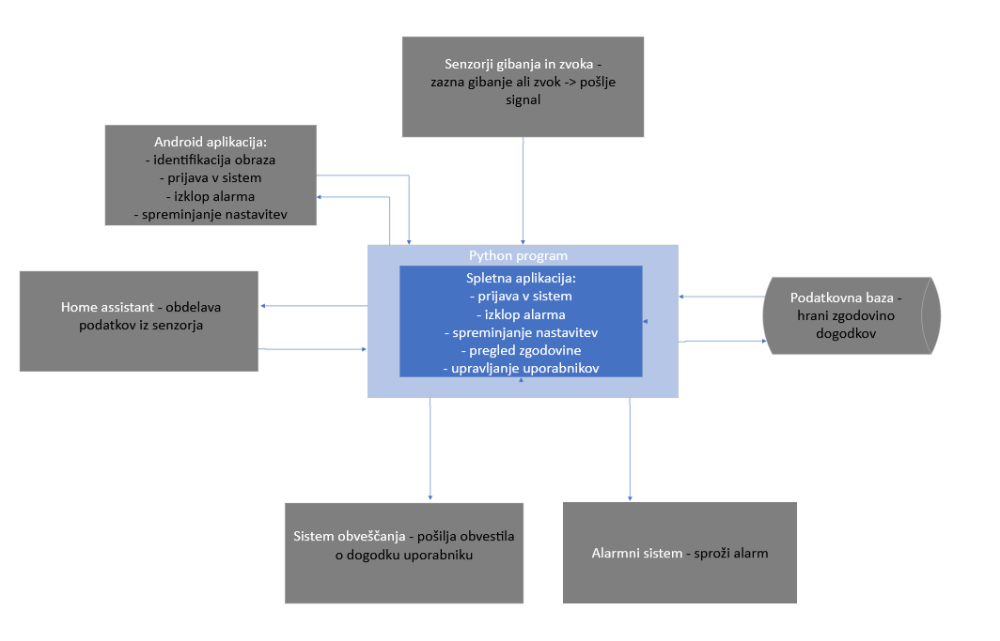

## 5 Trenutno stanje

Trenutno smo uspeli vzpostaviti platformo home assistant in zasnovali uporabniški vmesnik, da imamo boljšo predstavo in načrt, kako bo izgledala in delovala naša aplikacija. Naleteli smo na težave z uporabo platforme home assistant in posledično nismo uspeli narediti implementacijo uporabniškega vmesnika v celoti, za MVP, kot je bilo načrtovano za to iteracijo. Ni nam uspelo vzpostaviti okolja Home Assistant z docker-jem in smo kar nekaj časa porabili pri reševanju tega problema in iskanju alternativnih načinov za vzpostavitev sistema. Posledično je bil osrednji cilj te iteraciji razumevanje delovanja platforme Home Assistant in raziskovanje možnosti intergracije znotraj tega okolja, kar ni bilo planirano na zaćetku in je vplivalo na potek naše načrtovane implementacije.  Uspelo nam je oblikovati uporabniški vmesnik s pomočje Figme za spletno in mobilno aplikacijo ter implementirati osnovni uporabniški vmesnik za spletno implementacijo. Ker smo naleteli na težave pri osnovni implementaciji, nam ni uspelo nareediti nobenih testov.

Uspelo nam je implementirati osnovni vmesnik za upravljanje alarma in možnosti spreminjanje alarma glede na različne scenarije. Trenutni sistem zavzema prijavo v spletno aplikacijo, izklop alarma, možnosti spreminjanja nastavitev za alarm, pregled zgodovine ter brisanje in dodajanje uporabnikov. Pošiljanje obvestil ob sprožitvni alarma je bilo planirano, vendar nam ga zaradi zapletov z Home Assistantom, ni uspelo vključiti. 

***Figma mock za Home view***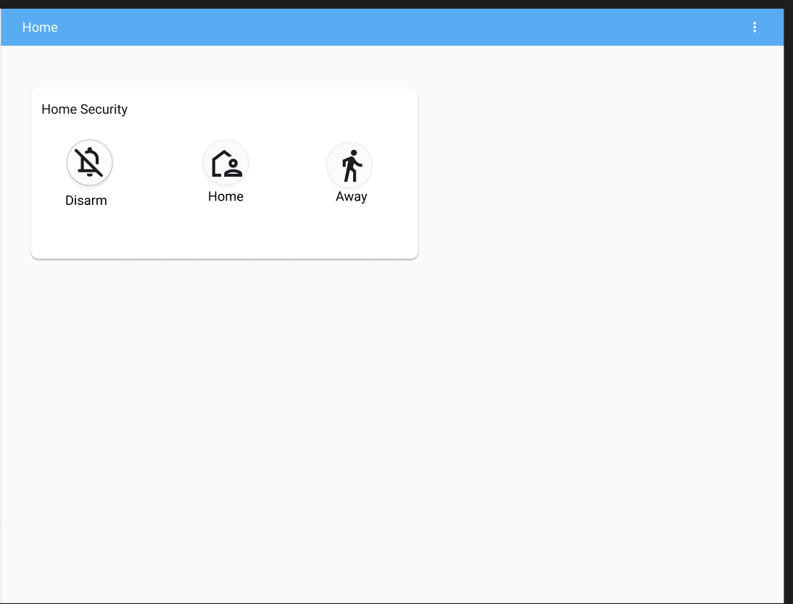

***Figma mock za Spreminanje stanja***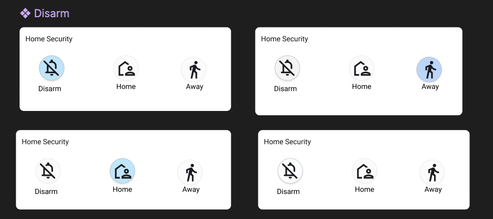

***Figma mock za Prijavo in ustvarjanje računa***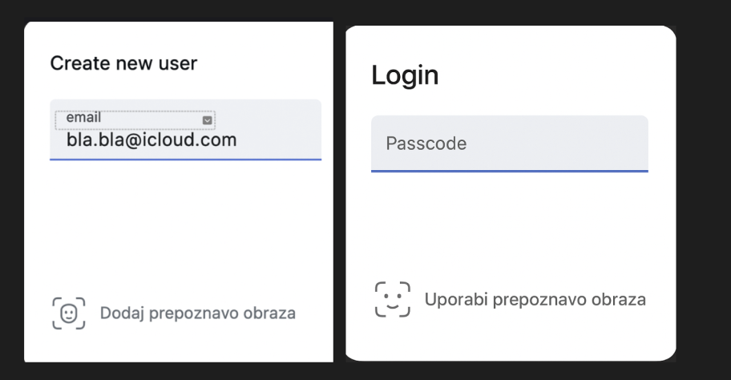

***Zaslonska slika za Security System***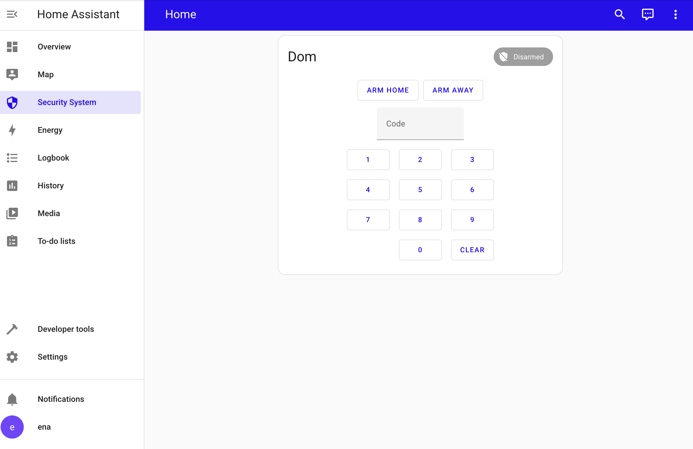

***Zaslonska slika za Upravljanje Senzorjev***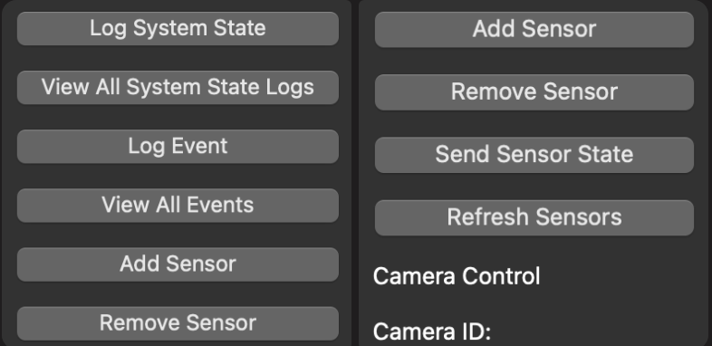

***Zaslonska slika za Napredno spreminanje stanja alarma***

  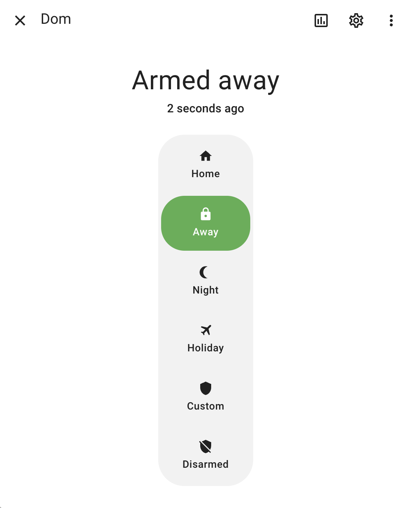

***Zaslonska slika za Pregled zgodovine dogodkov***

  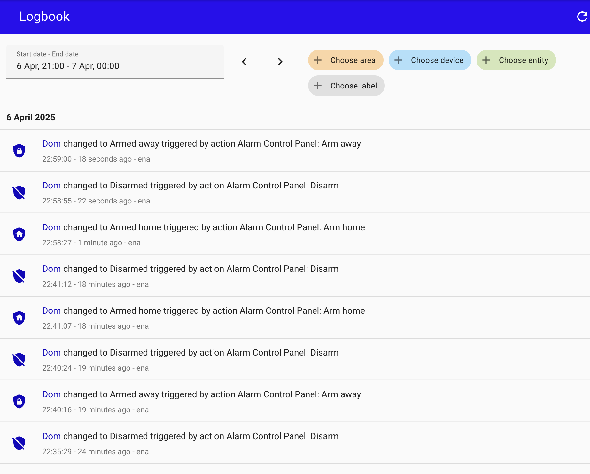

***Zaslonska slika za Dodajanje novega uporabnika***

  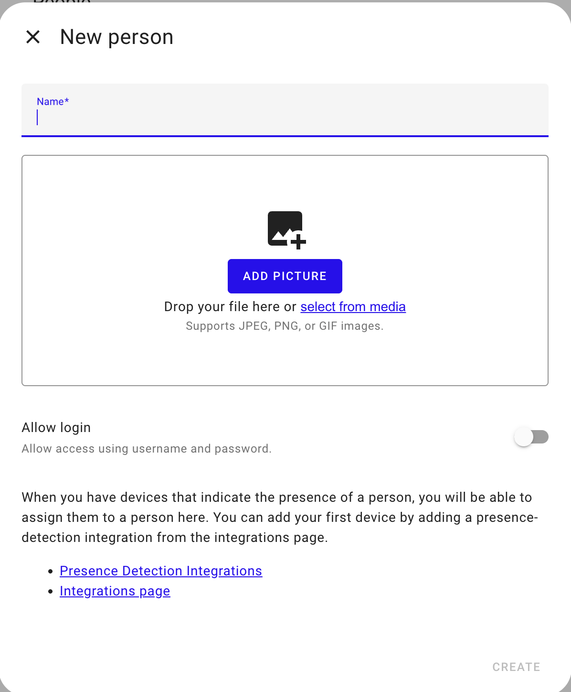

***Zaslonska slika za Brisanje uporabnikaa***

  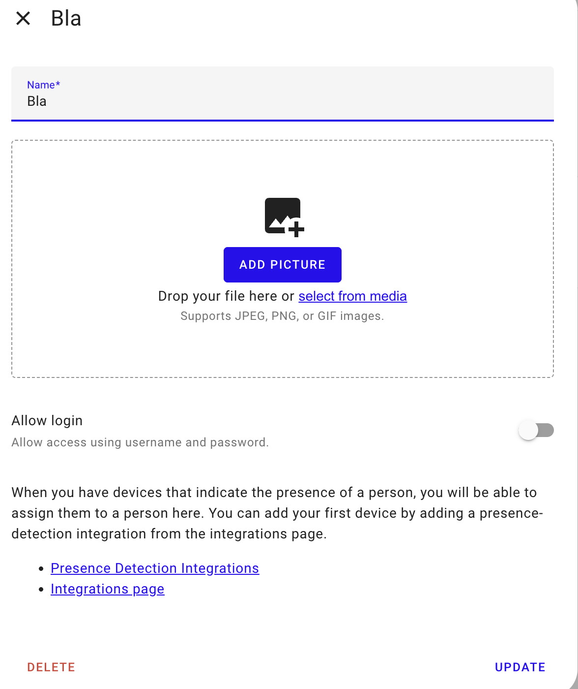

***Zaslonska slika za Izklop alarma***

  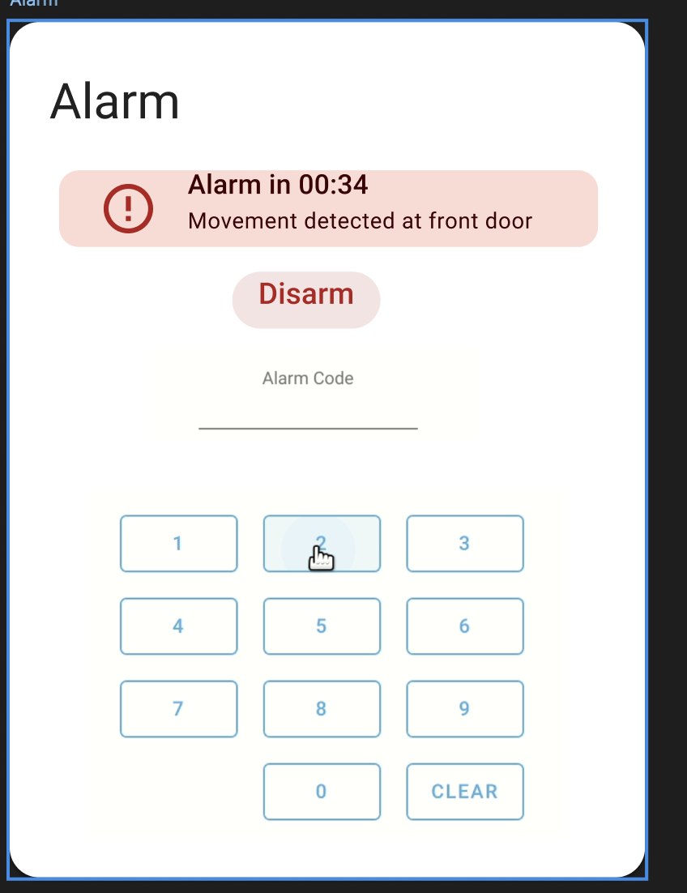

## 6 Vodenje projekta

| Datum | Opis | Motivacija | Posledica spremembe |
|-------|------|------------|--------------------|
| 24.3.2024 | Popravljen opis projekta | Želja po boljši preglednosti | Boljša preglednost in lažje razumevanje |
| 28.3.2024 | Popravljene uporabniške zgodbe | Želja po boljši preglednosti | Bolj natančno opredeljene zgodbe|
| 28.3.2024 | Popravljena tveganja | Želja po boljši preglednosti | Bolj natančno opisana tveganja |

V tej iteraciji smo imeli cilj sestaviti mvp(minimum viable product), kar nam je v večini uspelo. V naslednji iteraciji bo glavni cilj dokončati implementacijo naše rešitve ter uspešno povezati vse komponente, da bo sistem deloval tako kot smo si ga zamislili. Naš največji izziv je povezava Home assistanta z našo skripto oz. centralnim vozliščem. Hkrati moramo sistem pripeljati do točke, ko ga bomo lahko na koncu testirali, kar je ključno, za delujoč sistem, kar je seveda naš glavni cilj.

### 6.2 Projektni načrt

| **Oznaka** | **Naziv**                           | **Začetek** | **Konec** | **Trajanje** | **Odvisnosti** |
| ---------- | ----------------------------------- | ----------- | --------- | ------------ | -------------- |
| A0         | Predpriprave                        | 20.2.2025   | 24.2.2025 | 4            | /              |
| A1         | Izbira izziva                       | 25.2.2025   | 28.2.2025 | 2            | A0             |
| A2         | Pregled dokumentacije               | 1.3.2025    | 2.3.2025  | 2            | A1             |
| A3         | Planiranje prve iteracije           | 3.3.2025    | 4.3.2025  | 2            | A2             |
| A4         | Izdelava projektnega načrta         | 7.3.2025    | 9.3.2025  | 3            | A3             |
| A5         | Definiranje ciljev projekta         | 7.3.2025    | 9.3.2025  | 3            | A3             |
| A6         | Identificiranje omejitev in tveganj | 7.3.2025    | 9.3.2025  | 3            | A3             |
| A7         | Sestava predloga projekta           | 10.3.2025   | 16.3.2025 | 5            | A4, A5, A6     |
| A8         | Oblikovanje UI                      | 17.3.2025   | 21.3.2025 | 3            | A7             |
| A9         | Osnovno integracijo z Home Assistant| 22.3.2025   | 24.4.2025 | 3            | A8             |
| A10        | Postavitev baze                     | 22.3.2025   | 24.4.2025 | 3            | A8             |
| A11        | Obvestila v realnem času            | 22.3.2025   | 24.4.2025 | 3            | A8             |
| A12        | Simulacija senzorjev                | 25.3.2025   | 28.4.2025 | 2            | A9, A10, A11   |
| A13        | Izdelava osnutka sistema            | 29.3.2025   | 7.4.2025  | 7            | A12            |
| A14        | Izdelava izvedljivega sistem        | 7.4.2025    | 5.5.2025  | 18           | A13            |
| A15        | Izdelava končne izdaje              | 5.5.2025    | 26.5.2025 | 15           | A14            |

**Ganttov diagram** (izvorna koda :bar_chart: [PlantUML](./gradivo/plantuml/Gantt1.puml))

![PERT diagram](https://teaching.lavbic.net/plantuml/png/hLNRJjj047tVhnYHjogqiNEd28bBeo9LeXBj4-LX4u_DnklTQEsuhGkVm5_nOHtRwyKY1XNHXyJZ6VkSEJEpupGMQiCDJs39Lt5az5O5frfg0vdXAgKGgen933F8D1WHtMGG28EhJ6Z5MBhY4c7mViROOPhzbdZ4qendU2PuL8B-OG3S6FspiW2-28Kr_58I7_dks1qx_63VPQbBvxA4gTuwUP9O3sVXE0pAY3O16kiTBqvcdqu9hGKIOCYtClk6lx9ZAIALa1XOqHyQLYSAUryD1XiZDeRdk0SyXUC1zC8G9pZvA2dTWu2Rc9w10pYq_hwz7jq2ZE0M1lIZwmz5zuF7UqTnNYo5uI2AGkIyvl0gk5f9trvBEBz-5IOjE7lVIZYIb4-WusqfYA_4scRklu1A231heTfxXogveYJL6c5ZSWH1DMeX3rz09XJm1Ytenl6eFq39Sqx8UernfZ3YeFZ3lSbiEKRFm0yj4dZ35hxpD0Hd68ec-vMGQymRAei_VXl-UK1r5g5OMGwTu9eAb8DGaEMaHgrhdidRU2wHZAfE64WTyISgfi-WZoqCUEq6Eu-Rmukb5B7EAmdVpm_W8bKwLm8IlA7c5vZKD3FeBHQB-MdTbDhiswiJK_ROzzfqZSUnLUWqzdJSecgME1JmcMe7nsagw2cLrOJpVo0iaS5ldpBdSIEio-fLVLdomWukrTWYlGdxOfbJRuJaa8D1BXKcy73FqwrbyVuBowL8jhAkL8ggq8OcsHBuBnFu5WdyzkPmdfsJg5ErpMAYeJvWqYobOKEok_bsAQSM6uRjcNOUjiCfYfp6UYtA0_E4UFIQbLjDMaa1u_O0EW_RfOwrUhXNjDMAW3ShpHk_YdHiqM7Ihh3p4EdLkslOl-fPdFvIo-1w_uY-9um-ALq1Zz5te2lWCrhbNO4XeqtS5HXLWT8QEsl2QAzsFJnbj13thJLnrhJpuHcZXT0Lc5U1IiVWqIHDyswn98eEuxwplPRThTOZkLwtNey4UztgFAe0TQiZH0rYx2y0 "PERT diagram")

**Graf PERT** (izvorna koda :bar_chart: [PlantUML](./gradivo/plantuml/PERT1.puml))

## 7 Ekipa

Saj je naša ekipa sestavljena iz 4 članov je naloga za nas nekoliko težja, zato je dobra usklajenost še bolj pomembna kot pri ostalih ekipah. V tej iteraciji smo delo razdelili na 5 aktivnosti. Za oblikovanje UI ter zaslonske maske je poskrbela Ena. Imeli smo kar nekaj težav z osnovno integracijo z Home assistant-om, kar nam je vzelo tudi največ časa. Za to sta poskrbela Nikola in Ena. Podatkovno bazo je vzpostavil Nikola, kar je bilo precej enostavno. Za obvestila in izdelavo poročila pa sta poskrbela Anej in Enej. V tabeli manjka aktivnost simulacija senzorjev, saj nam je zmanjkalo časa, zato bomo to nadoknadili v naslednji iteraciji.

| Oznaka | Opis dela                                 | Anej | Enej | Ena     | Nikola  |
|:------:|-------------------------------------------|:----:|:----:|:-------:|:-------:|
| A8     | Oblikovanje UI                            | 0%   | 0%   | 100%    | 0%      | 
| A9     | Osnovno integracijo z Home Assistant      | 0%   | 0%   | 50%     | 50%     | 
| A10    | Postavitev baze                           | 0%   | 0%   | 0%      | 100%    | 
| A11    | Obvestila v realnem času                  | 50%  | 50%  | 0%      | 0%      | 
| A13    | Izdelava poročila                         | 60%  | 30%  | 5%      | 5%      | 

## 9 Refleksija

 
  V tej iteraciji smo uspešno vzpostavili osnovno projektno okolje, razdelili naloge med člane ekipe in izdelali prve komponente sistema. Zasnovali smo strukturo uporabniškega vmesnika, definirali ključne povezave med komponentami ter se začeli podrobneje seznanjati s tehnologijami, kot sta Home Assistant in PyQt. Poleg tega smo uspešno izpeljali vse načrtovane sestanke, tako dnevne stand-upe kot tedenska usklajevanja, kar je močno prispevalo k tekočemu delu in boljši komunikaciji v ekipi. 

  MVP sistema nam v tej iteraciji ni uspelo v celoti vzpostaviti. Čeprav smo pričakovali določeno zahtevnost, nas je vseeno presenetila kompleksnost povezovanja različnih tehnologij, še posebej Home Assistanta, s katerim nimamo veliko predhodnega znanja. Nekatere povezave med komponentami, kot so senzorji, Python skripte in Home Assistant, še ne delujejo popolnoma.

  Glavne težave so bile povezane z razumevanjem delovanja Home Assistanta, pomanjkanjem jasnih in enostavnih virov na spletu ter potrebo po dodatnem znanju iz področij kot so Docker, omrežne povezave, lokalni strežniki in avtomatizacije. Prav tako smo ugotovili, da nekatere funkcionalnosti zahtevajo več časa za razvoj, kot smo sprva predvideli.

  V naslednji iteraciji bomo več časa namenili praktičnemu testiranju posameznih komponent. Vsak modul bomo razvijali in preizkušali ločeno, preden ga vključimo v skupni sistem. Nadaljevali bomo z raziskovanjem dokumentacije, po potrebi pa bomo poiskali pomoč pri mentorjih ali spletni skupnosti.
 
  Osredotočili se bomo predvsem na izdelavo in povezovanje ključnih delov sistema. Cilje bomo zastavili bolj realistično in si bolj jasno razdelili naloge, da se izognemo zastoju pri implementaciji. Izboljšali bomo tudi notranjo komunikacijo in dokumentacijo v ekipi, da bo razvoj hitrejši in bolj usklajen. Glavni poudarek bo na tem, da vzpostavimo čim več funkcionalnega sistema, ki bo lahko osnova za končno rešitev.

