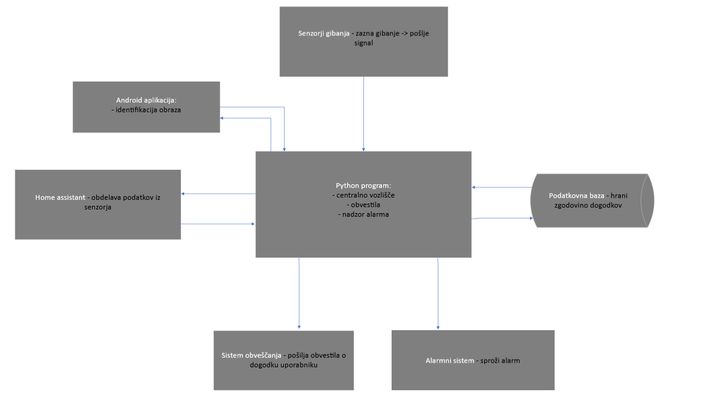

📃 Napredno upravljanje varnosti pametnega doma 

💁 Skupina 19: Anej Tomplak, Enej Smole, Ena Zorič, Nikola Kokotović

## 1 Uvod

V okviru predmeta Tehnologija programske opreme smo se odločili razviti napredni, vendar enostavni za uporabo, varnostni sistem za pametne domove, ki deluje v okviru odprtokodne platforme Home Assistant. Projekt izkorišča moč avtomatizacije in sodobnih tehnologij za izboljšanje varnosti domačih okolij z inteligentnim nadzorom in prilagodljivimi varnostnimi pravili.

**Motivacija** za projekt izhaja iz naraščajoče potrebe po bolj prilagodljivih in avtonomnih varnostnih sistemih v pametnih domovih. Potreba za to nastaja, saj si večina najemodaljcev v Ljubljani, predvsem študentov, želi na cenovno ugoden način zagotoviti varnost v domu. Nastaja potreba po sistemu, ki ga lahko uporaniki sami namestijo in upravljajo ter zlahka odstranijo, tako da ustrezna različnim scenarijem, kot so prisotnost v domu, nočni čas ali odsotnost. Trenutne reštive, ki so neodisve od varnostnih služb kot je Varnost, so sicer enostavne za uporabo, vendar ne zagotaljajo tolikšne varnosti doma in nadzora stanja alarma. Z razvojem te rešitve želimo zagotoviti, da bodo uporabniki lahko učinkoviteje nadzirali varnost svojega doma, ne glede na to, ali so fizično prisotni ali ne, saj večina trenutnih sistemov za varnost, omogoča nadzor samo od doma. Sistem bo sposoben samodejno prilagoditi varnostne protokole glede na različne scenarije, kot so prisotnost v domu, nočni čas ali odsotnost zaradi dopusta.

**Izvirnost** projekta se kaže v integraciji naprednih tehnologij zaznavanja gibanja, zvoka in vizualnega prepoznavanja v enoten sistem. Uporabniki lahko sistem namestijo sami in prilagodijo nastavitve, da ustreza njihovim potrebam, kar omogoča večjo neodvisnost od zunanjih storitev, kot je trenutno nastavljenih večina rešitev. Prav tako projekt vključuje razvoj odprtokodnega glasovnega pomočnika za interakcijo z uporabnikom in dodatno zanesljivost varnosti z uporabo tehnologije za prepoznavanje obrazov, kar je v industriji pametnih domov še vedno redkost.
Naš pristop temelji na realnih potrebah in željah končnih uporabnikov, ki želijo imeti popoln nadzor in prilagodljivost svojega varnostnega sistema, hkrati pa ohraniti enostavnost uporabe. S tem pristopom uporabniki več ne potrebujejo klicati varnostnih podjetij za namestitev sistema, saj lahko preko naše aplikacije enostavno namestijo in upravljajo varnostne funkcije sami, kar prinaša dodatno udobje in zmanjšuje stroške. Naša reštitev izstopa, saj omogoča tudi potrjevanje alarma z obraznim prepoznavanjem, kar omogoča večjo zaščito, kot je vnasanje samo kode, kot je trenutno implemenitrano pri večini rešitvah.
Projekt je zasnovan kot serija iteracij, v katerih vsaka faza vključuje analizo, načrtovanje, razvoj in testiranje, s ciljem ustvarjanja robustnega in učinkovitega varnostnega sistema. Vsaka faza bo podrobno dokumentirana in pregledana, da zagotovimo doslednost in kakovost končnega izdelka.


### 1.1 Izzivi

Glavni izzivi za ekipo:

 - Integracija Tehnologij: Uskladitev različnih tehnologij, kot so senzorji gibanja in zvočni senzorji

 - Uporabniška Izkušnja: Razvoj intuitivnega in izstopnega sistema za vse uporabnike

 - Optimizacija in Zanesljivost: Zagotavljanje stalnega in zanesljivega delovanja sistema

Načini naslavljanja izzivov:

 - Integracija Tehnologij: Uporaba standardiziranih protokolov in API-jev ter izvedba obsežnih testiranj

 - Uporabniška Izkušnja: Razvoj preprostih grafičnih vmesnikov

 - Optimizacija in Zanesljivost: Uporaba naprednih programskih tehnik in periodična testiranja sistema

Poznavanje Tehnologij

Ekipa ima izkušnje s Pythonom, vendar so nekatere specifične tehnologije nove kot Home Assistant in Scrum. Načrtovani so izobraževalni sestanki za debatiranje in seznanjanje novih tehnologij


## 2 Potrebe naročnika

**Primarni deležniki:** nosilci predmeta TPO, ki projekt vodijo in ocenjujejo. Njihova pričakovanja so:

 - Želijo videti inovativne rešitve s področja varnosti pametnih domov.

 - Pričakujejo uporabo sodobnih tehnologij

 - Pomembna je usklajenost z zahtevami naloge

 - Sistem mora biti delujoč prototip z realnimi ali simuliranimi podatki.


**Sekundarni deležniki:** splošni uporabniki pametnih domov, torej posamezniki in družine, ki bi tak sistem uporabljali v realnem življenju. Njihova pričakovanja so:

 - Enostavna uporaba: Sistem mora biti intuitiven in nezahteven za nastavitev.

 - Zanesljivost: Uporabniki želijo natančno zaznavanje nevarnosti in minimalno število lažnih alarmov.

 - Prilagodljivost: Sistem naj omogoča različne varnostne načine (doma, odsotnost, izklopljen).

 - Takojšnje obveščanje: Želijo takojšnja opozorila prek e-pošte ali glasovnih asistentov.

 - Varnost in zasebnost: Ključno je varno shranjevanje podatkov in zaščita pred zlorabami.

Splošna želena izkušnja uporabnikov je sistem, ki ne zahteva stalnega ročnega upravljanja – varnostna pravila se prilagajajo avtomatsko. Nudi občutek varnosti, ne da bi bil vsiljiv ali moteč. Omogoča hitro ukrepanje v primeru zaznane grožnje. Je združljiv z obstoječimi pametnimi napravami in enostaven za integracijo.

Nosilci predmeta pa pričakujejo, da bo projekt tehnično dovršen, inovativen in dobro dokumentiran.


### 2.1 Uporabniške zahteve


### Uporabniška zgodba 1
**Kot lastnik pametnega doma želim, da sistem zazna nenavadne aktivnosti (gibanje, neznane osebe), da lahko hitro ukrepam v primeru potencialne grožnje.**

**Testi sprejemljivosti:**
- Ko je prostor označen kot prazen in sistem zazna gibanje, uporabnik prejme varnostno opozorilo na mobilni telefon.
- Ko kamera zazna neznan obraz, sistem sproži opozorilo in priloži sliko osebe.
- Če uporabnik potrdi, da gre za lažni alarm, sistem to zabeleži in naslednjič ne sproži opozorila za isti vzorec.
- Sistem zazna zaporedne sumljive dogodke in jih prikaže kot povezan incident z opozorilom o ponavljanju.
- Uporabnik lahko v aplikaciji označi dogodek kot “nujno preveriti”, kar sproži dodatno opozorilo.

### Uporabniška zgodba 2
**Kot lastnik pametnega doma želim, da sistem samodejno prilagodi varnostni način (doma, odsotnost, izklopljen), da mi ni treba ročno spreminjati nastavitev.**

**Testi sprejemljivosti:**
- Ko uporabnik ročno nastavi način "odsotnost", se aktivirajo vsi senzorji in začne beleženje dogodkov.
- Če sistem zazna, da se je uporabnik vrnil domov, samodejno preklopi način na "doma".
- Če se zazna aktivnost, ki ne ustreza trenutnemu načinu, se uporabniku ponudi možnost ročne spremembe.
- V nastavitvah lahko uporabnik določi časovna pravila za samodejni preklop načinov.
- Če pride do napake pri zaznavi konteksta, se uporabniku izpiše opozorilo in predlog za nastavitev izjeme.

### Uporabniška zgodba 3
**Kot uporabnik želim prejemati varnostna obvestila prek mobilne aplikacije, e-pošte ali glasovnega asistenta, da lahko vedno ostanem obveščen o stanju svojega doma.**

**Testi sprejemljivosti:**
- Ko sistem zazna varnostno grožnjo, uporabnik prejme obvestilo na izbrani kanal.
- Če obvestilo ni bilo prebrano v določenem času, sistem pošlje opomnik.
- Če uporabnik ni dosegljiv prek aplikacije, se obvestilo pošlje na e-pošto kot rezervna pot.

### Uporabniška zgodba 4
**Kot uporabnik želim imeti dostop do zgodovine zaznanih dogodkov, da lahko preverim pretekle varnostne incidente.**

**Testi sprejemljivosti:**
- Ko uporabnik odpre zgodovino dogodkov, vidi seznam incidentov s časovnimi žigi in opisi.
- Dogodke lahko razvrsti po času, vrsti dogodka ali lokaciji senzorja.
- Če klikne na dogodek, se prikaže podrobnejši vpogled.

### Uporabniška zgodba 5
**Kot uporabnik želim, da se v aplikacijo lahko prijavim s prepoznavo obraza, da bo prijava hitrejša in varnejša.**

**Testi sprejemljivosti:**
- Ko uporabnik izbere prijavo z obrazom, sistem preveri skladnost in omogoči dostop.
- Če prepoznavanje ne uspe več kot trikrat, se omogoči prijava z geslom.
- Ob neuspešnem prepoznavanju se pošlje opozorilo in zabeleži incident.


### Uporabniška zgodba 6
**Kot uporabnik želim možnost prijave v aplikacijo z e-poštnim naslovom in geslom, da imam alternativen način dostopa.**

**Testi sprejemljivosti:**
- Ob pravilnem vnosu sistem omogoči dostop.
- Ob več napačnih poskusih sistem zaklene račun in pošlje opozorilo.
- Uporabnik lahko geslo spremeni v nastavitvah.
- Sistem beleži neuspele prijave.

### Uporabniška zgodba 7
**Kot uporabnik želim, da me aplikacija po e-pošti obvesti, če sistem zazna vlom, da sem lahko takoj obveščen.**

**Testi sprejemljivosti:**
- Ob zaznavi vloma se pošlje e-poštno opozorilo s podrobnostmi.
- Če sporočilo ni odprto v določenem času, se pošlje opomnik.

### Uporabniška zgodba 8
**Kot uporabnik želim, da sistem v načinu "away" aktivno spremlja gibanje in me obvesti, če zazna nepredvideno gibanje.**

**Testi sprejemljivosti:**
- Zaznano gibanje sproži obvestilo.
- Če ni potrjeno, se pošlje tudi e-pošta.
- Preverjanje znanih oseb zmanjša lažne alarme.

### Uporabniška zgodba 9
**Kot uporabnik želim, da sistem v načinu "home" pasivno spremlja dogajanje in ne sproži alarma, razen ob zaznavi nenavadne aktivnosti.**

**Testi sprejemljivosti:**
- Običajno gibanje ne sproži alarma.
- Nenavadno gibanje sproži obvestilo.
- Možnost ogleda žive slike in ročne sprožitve alarma.
- Dogodki se zabeležijo kljub neaktivnemu alarmu.

### Uporabniška zgodba 10
**Kot uporabnik želim, da ob ročni deaktivaciji alarma sistem ne spremlja varnostnih dogodkov, razen če je posebej nastavljen za snemanje.**

**Testi sprejemljivosti:**
- Alarm izklopljen = brez obvestil.
- Možnost dostopa do zgodovine.
- Sistem opozori, če je snemanje aktivno.
- Uporabnik izbere, kaj ostane aktivno.

### Uporabniška zgodba 11
**Kot uporabnik želim, da lahko ob pozabljeni prijavi geslo ponastavim preko e-pošte.**

**Testi sprejemljivosti:**
- Sistem pošlje povezavo za ponastavitev.
- Po poteku časa povezava postane neveljavna.
- Dodaten varnostni ukrep (npr. koda ali vprašanje).

### Uporabniška zgodba 12
**Kot uporabnik želim, da lahko dodajam in odstranjujem senzorje v sistemu.**

**Testi sprejemljivosti:**
- Novi senzor se pojavi in začne delovati.
- Napačna konfiguracija sproži napako.
- Odstranjen senzor izgine iz sistema.
- Zgodovina beleži spremembe.

### Uporabniška zgodba 13
**Kot uporabnik želim, da se alarm samodejno sproži ob nepooblaščenem vstopu.**

**Testi sprejemljivosti:**
- Gibanje sproži alarm.
- Uporabnik prejme obvestilo s podrobnostmi.
- Dogodek se shrani z vsemi podatki.

### Uporabniška zgodba 14
**Kot uporabnik želim nastaviti časovno izjemo za izklop alarma.**

**Testi sprejemljivosti:**
- Gibanje v izbranem času ne sproži alarma.
- Zunaj časovnega okna se alarm sproži.
- Uporabnik lahko ureja izjeme.
- Opozorilo, če zaznava poteka v času izjeme.

### Uporabniška zgodba 15
**Kot uporabnik želim prejemati periodična poročila o delovanju sistema.**

**Testi sprejemljivosti:**
- Sistem pošlje tedensko/mesečno poročilo.
- Vključuje statistiko dogodkov.
- Uporabnik lahko onemogoči prejemanje poročil.
- Opozorilo, če poročilo ni bilo poslano.

### Uporabniška zgodba 16
**Kot uporabnik želim nastaviti urnik za samodejni vklop/izklop alarma.**

**Testi sprejemljivosti:**
- Alarm se aktivira po urniku.
- Potrditev vklopa/izklopa se prikaže uporabniku.
- Urnik je mogoče začasno izklopiti.
- Možnost različnih urnikov po dnevih.

### Uporabniška zgodba 17
**Kot uporabnik želim dodeliti dostop drugim družinskim članom.**

**Testi sprejemljivosti:**
- Novi član prejme vabilo z dodeljenimi pravicami.
- Dostop je omejen glede na vlogo.
- Lastnik lahko ureja ali odstrani dostop.
- Vsak uporabnik ima ločeno zgodovino dejavnosti.

### Uporabniška zgodba 18
**Kot uporabnik želim preveriti status senzorjev.**

**Testi sprejemljivosti:**
- Seznam senzorjev prikazuje trenutni status.
- Nedelujoči senzor sproži opozorilo.
- Status se redno osvežuje.
- Uporabnik lahko sproži ročni test.

### Uporabniška zgodba 19
**Kot uporabnik želim z glasovnimi ukazi upravljati alarm.**

**Testi sprejemljivosti:**
- Glasovni ukaz sproži akcijo in zvočno potrditev.
- Nejasen ukaz sproži prošnjo za ponovitev.
- Neavtoriziran glas ne sproži dejanja.
- Možnost izklopa funkcije.

### Uporabniška zgodba 20
**Kot uporabnik želim, da me glasovni asistent obvesti o statusu sistema.**

**Testi sprejemljivosti:**
- Uporabnik prejme govorno informacijo o stanju.
- Asistent poda informacije o načinu, dogodkih in senzorjih.
- Če ni povezave, se poda ustrezno sporočilo.


# 3. Cilji projekta  

Cilj tega projekta je razviti pametni varnostni sistem, ki bo reševal ključne izzive na področju varnosti doma. Sistem bo omogočal:  

- Preprečevanje nepooblaščenih vstopov v dom.  
- Samodejno prilagajanje varnostnih nastavitev glede na prisotnost uporabnika.  
- Neprekinjen nadzor nad dogajanjem v domu.  
- Zbiranje dokazov v primeru nepooblaščenega dostopa, ki bi lahko pomagali organom pregona.  
- Zaščito pred nepooblaščeno manipulacijo varnostnega sistema.  
- Boljši pregled nad delovanjem varnostne opreme v pametnem domu.  

### 3.1 Končni izdelki projekta  

Projekt bo ob zaključku vključeval naslednje ključne komponente:  

- **Pametni varnostni sistem:** Prototip, ki vključuje simulirane senzorje gibanja, zvoka in vizualnega prepoznavanja.  
- **Uporabniški vmesnik:** Intuitivna PC in mobilna aplikacija za enostavno upravljanje varnostnega sistema.  
- **Dokumentacija:** Podrobna tehnična dokumentacija, ki bo vključevala navodila za namestitev, uporabo in vzdrževanje sistema.  
- **Poročilo o testiranju:** Analiza zanesljivosti in učinkovitosti sistema na podlagi izvedenih testov.  

### 3.2 Ključne prednosti sistema  

Naš projekt bo uporabnikom prinesel več pomembnih prednosti:  

- **Enostavna uporaba:** Intuitiven vmesnik bo omogočal hitro nastavitev in uporabo sistema brez potrebe po tehničnem znanju.  
- **Zanesljivost:** Sistem bo zagotavljal natančno zaznavanje varnostnih groženj z minimalnim številom lažnih alarmov.  
- **Prilagodljivost:** Uporabnik bo lahko izbiral med različnimi varnostnimi načini, prilagojenimi njegovim potrebam.  
- **Takojšnje obveščanje:** Sistem bo omogočal hitro obveščanje prek mobilnih naprav, e-pošte ali glasovnih asistentov.  
- **Varnost in zasebnost:** Vsi podatki bodo varno shranjeni, brez potrebe po povezavi z oblakom.  

S tem bomo zagotovili, da bo sistem zagotavljal občutek varnosti brez nepotrebnega poseganja v zasebnost uporabnika, hkrati pa bo omogočal hitro ukrepanje ob zaznanih nevarnostih.  

### 3.3 Merila uspeha

Uspešnost projekta bomo ocenjevali na podlagi naslednjih kriterijev:  

- **Natančnost zaznavanja:** Sistem mora pravilno prepoznati vsaj 95 % varnostnih groženj in imeti manj kot 5 % lažnih alarmov.  
- **Čas odziva:** Obvestilo uporabniku mora biti poslano v manj kot 5 sekundah po zaznavi nevarnosti.  
- **Uporabniška izkušnja:** Vsaj 90 % uporabnikov mora oceniti sistem kot enostaven za uporabo.  
- **Prilagodljivost:** Sistem mora podpirati najmanj tri varnostne načine (doma, odsoten, izklopljeno) ter omogočati samodejno prilagajanje glede na kontekst.  

S temi merili bomo zagotovili, da projekt izpolnjuje pričakovanja uporabnikov in zagotavlja zanesljivo varnostno rešitev.  

## 4 Opis sistema

Sistem je zasnovan za zaznavanje gibanja, sprožitev alarma in obveščanje uporabnikov. Tukaj je opis posameznih komponent in njihove vloge:

Senzorji gibanja:

- Zaznajo gibanje in pošljejo signal centralnemu vozlišču za nadaljnjo obdelavo.

Python program (centralno vozlišče): deluje kot glavni nadzorni center sistema. Sprejema signale iz senzorjev gibanja, obdeluje prejete podatke in sproži ustrezne odzive, kot so:

- Pošiljanje podatkov za identifikacijo obraza v Android aplikacijo.

- Pošiljanje obvestil uporabnikom.

- Sprožitev alarma, če je potrebno.

- Shranjevanje dogodkov v podatkovno bazo za kasnejši pregled.

Android aplikacija:

- Uporablja se za identifikacijo obraza, kar omogoča vstop v sistem.

- Pošilja rezultate identifikacije nazaj v Python program.

Home assistant:

- Obdeluje podatke iz senzorjev.

Podatkovna baza:

- Hrani zgodovino vseh dogodkov, kot so zaznana gibanja, sprožitve alarmov in poslanih obvestil.

Sistem obveščanja:

- Pošilja obvestila uporabnikom (npr. prek e-pošte) o zaznanih dogodkih.

Alarmni sistem:

- Sproži alarm v primeru nepooblaščenega gibanja ali neprepoznane osebe.



## 5 Predlagan pristop

Sistem bo deloval kot celovita rešitev za varnost pametnih domov z uporabo Home Assistant kot osnovne platforme. Glavne funkcije vključujejo zaznavanje gibanja, vizualno prepoznavanje in integracijo glasovnih ukazov. Uporabniki bodo lahko preko aplikacije spremljali in upravljali varnostne nastavitve, prilagojene njihovim potrebam. Sistem bo v realnem času obveščal uporabnike o kakršnih koli varnostnih incidentih in omogočal hitro odzivanje.

Uporabniki lahko preko našega sistema povežajo različne senzorje gibanja, senzorje, ki zaznavajo odpiranje vrat in kamere. 

**Scenariji uporabe:**

  **1 Odsotnost Doma (Away Mode):**
  Ko je sistem nastavljen na "Away" oz “Odsotnost”, se aktivira povečana občutljivost senzorjev za gibanje. Če senzorji zaznajo gibanje, uporabnik prejme obvestilo, da se bo alarm vklopil čez eno minuto. Uporabnik ima možnost prekiniti ta postopek preko mobilne aplikacije ali glasovnim ukazom. Če prekinitve ni, se alarm aktivira. Uporabnik lahko alarm kadarkoli izklopi preko aplikacije s prepoznavanjem obraza

  **2 Prisotnost Doma (Home Mode):**
  Ko je uporabnik doma, lahko prilagodi nastavitve alarma, da se sproži samo na določenih točkah, ki so bolj izpostavljene možnim vlomom (npr. vrata, okna). Alarm bo sprožen samo, če senzorji zaznajo gibanje na teh točkah

  **3 Izklopljen sistem senzorjev in alarm**

Uporabniki lahko enostavno preklapljajo med temi načini preko mobilne aplikacije ali z glasovnimi ukazi.


## Uporabljene Platforme, Orodja in Knjižnice ##

- **Platforma:** Home Assistant za integracijo vseh pametnih naprav, glasovnega prepoznavanja in senzorjev v domu
- **Programski jezik:** Python za razvoj dodatnih integracij in za user interface in Java za Android development
- **Knjižnice:**
  - **OpenCV** za prepoznavanje obrazov
  - **PyQt** za UI programa
  - **SQLite** za bazo
- **Orodja:**
  - **GitHub** za verzioniranje in sodelovanje v kodi
  - **Android Studio** za aplikacijo

## Testiranje sistema ##

Testiranje sistema bo potekalo na več ravneh:
- **Enotsko testiranje (Unit testing):**  Za preverjanje posameznih modulov kode z uporabo knjižnice pytest
- **Simulacija senzorjev**: Za preverjanje delovanja sistema ob različnih in s simulacijo resničnih scenarijev


## 6 Vodenje projekta

Za sledenje spremembam projekta smo ustvarili datoteko [Dnevnik sprememb](Dnevnik_sprememb.md).
Za razvoj projekta bomo uporabljali agilno metodologijo Scrum, ki omogoča fleksibilnost in hitre iteracije. To vključuje dnevne stand-up sestanke za pregled napredka in reševanje težav, tritedenske sprinte za razvoj funkcionalnosti in retrospektive ob koncu vsakega sprinta za izboljšanje procesa.

**Dobre Prakse**
**Kodni pregledi**: Redni pregledi kode znotraj ekipe, ki spodbujajo sodelovanje in izmenjavo znanja ter zagotavljajo visoko kakovost koda. Člani drug drugemu pregledajo kodo in se pogovorijo o možnih izboljšavah

**Delitev taskov in dela**: za organizacijo in delitev dela, uporaba aplikacije Click-up, za lažjo delitev taskov in organizacijo sestankov

**Team buidling**: člani ekipe se bodo sestali na skupnih aktivnostih, kot je piknik na Špici

**Minimalni Delujoči Sistem (MVP)**

Za naslednjo iteracijo nameravamo zgraditi minimalni delujoči sistem, ki bo vključeval:
- **Oblikovanje UI**:  Osnovni uporabniški vmesnik, ki omogoča upravljanje alarma in prejemanje obvestil
- **Osnovno integracijo z Home Assistant**: Vzpostavitev povezave med našo aplikacijo in Home Assistant platformo
- **Postavitev baze**:Ustvarjanje osnovne podatkovne baze za shranjevanje uporabniških nastavitev in zgodovine obvestil
- **Obvestila v realnem času**:  Sistem bo zmožen pošiljati takojšnja obvestila uporabnikom ob zaznavi dogodkov s senzorjev
- **Simulacija senzorjev**:  Implementacija simuliranih senzorskih dogodkov za testiranje in demonstracijo sistema

**Seznam Želja za Funkcije**

Naš seznam želja za funkcije v prihodnjih razvojnih ciklih vključuje:

- **Prepoznava obraza**: Integracija tehnologije za prepoznavanje obraza za izboljšanje varnosti
- **Glasovni ukazi**: Implementacija lokalno delujočega glasovnega asistenta za upravljanje sistema s glasovnimi ukazi
- **Napredne avtomatizacije**: Razvoj prilagodljivih scenarijev za avtomatizacijo doma, ki temeljijo na času dneva, lokaciji uporabnika in drugih pogojih


### 6.1 Usklajevanje ekipe

Delo bomo razporedili med člani ekipe, tako da bo vsak delal tisto v čemer je najboljši. Enemu članu ekipe bo pripisan naziv SCRUM master, ki bo odgovoren/na za vodenje in organiziranje sestankov in retrospektivo. 

**Sestanki Ekipe**

- **Dnevni Stand-up Sestanki**: Vsak dan bomo imeli kratke sestanke (15 minut) na daljavo, kjer bo vsak član ekipe poročal o svojem napredku, načrtih za tekoči dan
- **Tedenski Sestanki**: Na teh sestankih, ki bodo potekali enkrat na teden, bomo pregledali in po potrebi prilagodili projektne načrte, se pogovorili o potencialnih problemih in jih skušali rešiti
- **Retrospektive**: Na koncu vsake iteracije se bomo sestali in ocenili kaj je bilo v tej iteraciji uspešno, kaj je šlo narobe in kaj lahko izboljšamo v naslednji iteraciji


### 6.2 Projektni načrt

#### 6.2.1 Povzetek razdelitve projekta na aktivnosti

Uporabljali bomo metodo SCRUM, kar pomeni da moramo projekt razdeliti na iteracije. V našem primeru smo se odločili za 4 iteracije: Predlog projekta, Osnutek sistema, Izvedljiv sistem in Končna izdaja. Prvi del(Predlog projekta) je sestavljen iz 7 aktivnosti, ki so priprava na razvoj projekta(A1 - A7). Drugi del(Osnutek sistema) predstavljajo akrivnosti A8 - A13, ki jih bomo izvedli v naslednji iteraciji, tretji del(Izvedljiv sistem) predstavlja aktivnost A14 in četrti del(Končna izdaja) predstavlja aktivnost A15. Kot vidite na spodnjem Ganttovem diagramu smo izbrali sredo in četrtek kot vikend namesto sobote in nedelje, ker nam to bolj ustreza, saj imamo ob sobotah in nedeljah več časa za delo na projektu kot med tednom. Torej ob sredah in četrtkih ne bomo delali na projektu.


#### 6.2.2 Aktivnosti

| **Oznaka** | **Naziv**                           | **Začetek** | **Konec** | **Trajanje** | **Odvisnosti** |
| ---------- | ----------------------------------- | ----------- | --------- | ------------ | -------------- |
| A0         | Predpriprave                        | 20.2.2025   | 24.2.2025 | 4            | /              |
| A1         | Izbira izziva                       | 25.2.2025   | 28.2.2025 | 2            | A0             |
| A2         | Pregled dokumentacije               | 1.3.2025    | 2.3.2025  | 2            | A1             |
| A3         | Planiranje prve iteracije           | 3.3.2025    | 4.3.2025  | 2            | A2             |
| A4         | Izdelava projektnega načrta         | 7.3.2025    | 9.3.2025  | 3            | A3             |
| A5         | Definiranje ciljev projekta         | 7.3.2025    | 9.3.2025  | 3            | A3             |
| A6         | Identificiranje omejitev in tveganj | 7.3.2025    | 9.3.2025  | 3            | A3             |
| A7         | Sestava predloga projekta           | 10.3.2025   | 16.3.2025 | 5            | A4, A5, A6     |
| A8         | Oblikovanje UI                      | 17.3.2025   | 21.3.2025 | 3            | A7             |
| A9         | Osnovno integracijo z Home Assistant| 22.3.2025   | 24.4.2025 | 3            | A8             |
| A10        | Postavitev baze                     | 22.3.2025   | 24.4.2025 | 3            | A8             |
| A11        | Obvestila v realnem času            | 22.3.2025   | 24.4.2025 | 3            | A8             |
| A12        | Simulacija senzorjev                | 25.3.2025   | 28.4.2025 | 2            | A9, A10, A11   |
| A13        | Izdelava osnutka sistema            | 29.3.2025   | 7.4.2025  | 7            | A12            |
| A14        | Izdelava izvedljivega sistem        | 7.4.2025    | 5.5.2025  | 18           | A13            |
| A15        | Izdelava končne izdaje              | 5.5.2025    | 26.5.2025 | 15           | A14            |


- Povzetek razdelitve projekta na aktivnosti s seznamom izdelkov, vključno z Ganttovim diagramom in grafom PERT.


**Ganttov diagram** (izvorna koda :bar_chart: [PlantUML](./gradivo/plantuml/Gantt.puml))

![PERT diagram](https://teaching.lavbic.net/plantuml/png/hLNRJjj047tVhnYHjogqiNEd28bBeo9LeXBj4-LX4u_DnklTQEsuhGkVm5_nOHtRwyKY1XNHXyJZ6VkSEJEpupGMQiCDJs39Lt5az5O5frfg0vdXAgKGgen933F8D1WHtMGG28EhJ6Z5MBhY4c7mViROOPhzbdZ4qendU2PuL8B-OG3S6FspiW2-28Kr_58I7_dks1qx_63VPQbBvxA4gTuwUP9O3sVXE0pAY3O16kiTBqvcdqu9hGKIOCYtClk6lx9ZAIALa1XOqHyQLYSAUryD1XiZDeRdk0SyXUC1zC8G9pZvA2dTWu2Rc9w10pYq_hwz7jq2ZE0M1lIZwmz5zuF7UqTnNYo5uI2AGkIyvl0gk5f9trvBEBz-5IOjE7lVIZYIb4-WusqfYA_4scRklu1A231heTfxXogveYJL6c5ZSWH1DMeX3rz09XJm1Ytenl6eFq39Sqx8UernfZ3YeFZ3lSbiEKRFm0yj4dZ35hxpD0Hd68ec-vMGQymRAei_VXl-UK1r5g5OMGwTu9eAb8DGaEMaHgrhdidRU2wHZAfE64WTyISgfi-WZoqCUEq6Eu-Rmukb5B7EAmdVpm_W8bKwLm8IlA7c5vZKD3FeBHQB-MdTbDhiswiJK_ROzzfqZSUnLUWqzdJSecgME1JmcMe7nsagw2cLrOJpVo0iaS5ldpBdSIEio-fLVLdomWukrTWYlGdxOfbJRuJaa8D1BXKcy73FqwrbyVuBowL8jhAkL8ggq8OcsHBuBnFu5WdyzkPmdfsJg5ErpMAYeJvWqYobOKEok_bsAQSM6uRjcNOUjiCfYfp6UYtA0_E4UFIQbLjDMaa1u_O0EW_RfOwrUhXNjDMAW3ShpHk_YdHiqM7Ihh3p4EdLkslOl-fPdFvIo-1w_uY-9um-ALq1Zz5te2lWCrhbNO4XeqtS5HXLWT8QEsl2QAzsFJnbj13thJLnrhJpuHcZXT0Lc5U1IiVWqIHDyswn98eEuxwplPRThTOZkLwtNey4UztgFAe0TQiZH0rYx2y0 "PERT diagram")

**Graf PERT** (izvorna koda :bar_chart: [PlantUML](./gradivo/plantuml/PERT.puml))

### 6.3 Finančni načrt

Finančni načrt projekta po metodi COCOMO II, in sicer zgodnji model načrta.

Dekompozicija aplikacije - Python program:
- 3 zaslonske maske za unos podatkov
- Obdelava podatkov iz 3 različna senzorja
- relacijska baza z 3 tabelami
- 1 poročilo z izpisom podatkov senzorjev iz baze
- 1 poročilo o prisotnim senzorjem v sistemu
- 1 poročilo z trenutnim dogodkom glede na stanje aplikacije

Dekompozicija aplikacije - Android:
- 2 zaslonski maski za unos podatkov

#### 6.3.1.1 Izračun velikosti projekta Python

**Funkcionalnosti tipa EI (External Input):**
Zaslonske maske za unos podatkov in obdelavo podatkov iz senzorjev.

DET (Data Element Types): 
  - DET1: ime uporabnika
  - DET2: priimek uporabnika
  - DET3: e-poštni naslov uporabnika
  - DET4: skeniranje obraza uporabnika

  - DET5: sprememba stanja sistema

  - DET6: ime senzorja dodanega v sistem
  - DET7: vrsta senzorja dodanega v sistem
  - DET8: lokacija senzorja dodanega v sistem
  - DET9: vklop/izklop senzorja
  - DET9: odstranjevanje senzorjev iz sistema

  - DET10: dogodek zaznan na senzorju
  - DET11: čas dogodka
  - DET12: lokacija dogodka

FTR (File Types Referenced): 
  - FTR1: podatki uporabnika
  - FTR2: podatki senzorjev
  - FTR3: zgodovina dogodkov

**Funkcionalnosti tipa EO (External Output):**
Obveščanje uporabnika o dogodkih.

DET (Data Element Types): 
  - DET1: dogodek zaznan na senzorju
  - DET2: ime senzorja
  - DET3: čas dogodka
  - DET4: lokacija dogodka
  - DET5: ime uporabnika
  - DET6: e-poštni naslov uporabnika
  - DET7: stanje sistema

FTR (File Types Referenced):
  - FTR1: podatki senzorja
  - FTR2: podatki uporabnika

**Funkcionalnosti tipa EQ (External Query):**
Poročilo o prisotnim senzorjem v sistemu, zgodovini dogodkov in uporaniku.

DET (Data Element Types): 
  - DET1: ime senzorja
  - DET2: vrsta senzorja
  - DET3: lokacija senzorja

  - DET4: ime uporabnika
  - DET5: priimek uporabnika
  - DET6: e-poštni naslov uporabnika
  - DET7: stanje sistema

  - DET8: dogodek zaznan na senzorju
  - DET9: čas dogodka
  - DET10: lokacija dogodka

FTR (File Types Referenced):
  - FTR1: podatki senzorja
  - FTR2: podatki uporabnika
  - FTR3: zgodovina dogodkov

**Funkcionalnosti tipa ILF (Internal Logical File):**
Relacijska baza z 3 tabelami.

DET (Data Element Types): 
  - DET1: id senzorja
  - DET2: ime senzorja
  - DET3: vrsta senzorja
  - DET4: lokacija senzorja

  - DET5: id uporabnika
  - DET6: ime uporabnika
  - DET7: priimek uporabnika
  - DET8: e-poštni naslov uporabnika
  - DET9: stanje sistema

  - DET10: id dogodka
  - DET11: dogodek zaznan na senzorju
  - DET12: čas dogodka

RET (Record Element Types):
  - RET1: podatki senzorja
  - RET2: podatki uporabnika
  - RET3: zgodovina dogodkov

**Izračun točk funkcionalnosti Python:**

| **Vrsta FP** | **Ime Funkcionalnosti** | **Objekt FP** | **Obseg** | **Utež** | 
| ------------ | ----------------------- | ------------- | --------- | -------- |
| EI           | Prijava v sistem        | zaslon        | LOW       | 3        |
| EI           | Kontrola senzorja       | zaslon        | LOW       | 3        |
| EI           | Sprememba stanja sistema| zaslon        | LOW       | 3        |
| EI           | Zaznavanje dogodka      | senzor        | LOW       | 3        |
| EO           | Obveščanje uporabnika   | back-end      | AVERAGE   | 5        |
| EQ           | Prikaz senzorjev        | poročilo      | LOW       | 3        |
| EQ           | Prikaz dogodkov         | poročilo      | LOW       | 3        |
| EQ           | Prikaz uporabnika       | poročilo      | LOW       | 3        |
| ILF          | Baza podatkov           | baza          | LOW       | 7        |
| **Skupaj**   |                         |               |           | **33**   |

Za razvijanje programa v Pythonu bomo uporabili faktor [53.33](https://www.ifpug.org/wp-content/uploads/2017/04/IYSM.-Thirty-years-of-IFPUG.-Software-Economics-and-Function-Point-Metrics-Capers-Jones.pdf) za izračun velikosti projekta.

#### 6.3.1.2 Izračun velikosti projekta Android

**Funkcionalnosti tipa EI (External Input):**
Zaslonske maske za unos podatkov.

DET (Data Element Types):
  - DET1: e-poštni naslov uporabnika
  - DET2: skeniranje obraza uporabnika

  - DET3: izklop alarma

FTR (File Types Referenced):
  - FTR1: podatki uporabnika

**Izračun točk funkcionalnosti Android:**

| **Vrsta FP** | **Ime Funkcionalnosti** | **Objekt FP** | **Obseg** | **Utež** |
| ------------ | ----------------------- | ------------- | --------- | -------- |
| EI           | Prijava v sistem        | zaslon        | LOW       | 3        |
| EI           | Kontrola alarma         | zaslon        | LOW       | 3        |
|**Skupaj**    |                         |               |           | **6**    |

Za razvijanje programa v Androidu/Javi bomo uporabili faktor [53.33](https://www.ifpug.org/wp-content/uploads/2017/04/IYSM.-Thirty-years-of-IFPUG.-Software-Economics-and-Function-Point-Metrics-Capers-Jones.pdf) za izračun velikosti projekta.

**Velikost projekta:**
```
Velikost projekta = 39 * 53.33 / 1000 = 2.08 KSLOC
```

#### 6.3.2 Izračun parametra B
```
B = 1.01 + 0.01 × ∑(wᵢ)
```

Lastnosti projektne skupine:
- **PREC**: Skupina nikoli ni delala na podobnem projektu
- **FLEX**: Zahteve so delno fleksibilne, glede načina implementacije posameznih funkcionalnosti
- **RESL**: Skupina je pripravljena na osnovna tveganja, 
            ampak glede na izkušnje skupina obstaja velika možnost nepredvidenih tveganj
- **TEAM**: Skupina je sestavljena iz študentov, ki niso prej sodelovali skupaj
- **PMAT**: Rezultat vprašalnika je

| **Parametri** | **Vrednost** | **Utež** |        |
| ------------- | ------------ | -------- | ------ |
| **PREC**      | zelo nizka   | 5        | 0.05   |
| **FLEX**      | nominalna    | 3        | 0.03   |
| **RESL**      | nominalna    | 3        | 0.03   |
| **TEAM**      | zelo nizka   | 5        | 0.05   |
| **PMAT**      | zelo nizka   | 5        | 0.05   |
| **B**         |              | 21       | **2.10** |

```
B = 1.01 + 0.01 * 21 = 1.22
```

#### 6.3.3 Izračun parametra M
```
M = ∏(multiplierᵢ)
```

Lastnosti projekta in izvajalcev:
**PERS**: člani so dovolj usposobljeni glede na šolanje - 0.80
**PREX**: nekateri člani poznajo Python, nekateri poznajo Android Studio, noben pa nepozna Home Assistant - 1.10
**RCPX**: projekt je kompleksen glede na uporabo različnih tehnologij, vendar je olajšan z uporabo in integracijo Home Assistant platforme - 1.10
**RUSE**: projekat zahteva 3 komponente (glavni program v Pythonu, mobilna aplikacija v Android Studiu in podatkovna baza) - 0.90
**PDIF**: spreminjajo se dve platforme (PC in Android) - 0.65
**FCIL**: za razoj projekta se uporabljajo Visual Studio Code, Android Studio, GitHub, ClickUp in Discord - 0.60

Meje vrednosti faktorjev RCPX, RUSE, PDIF:
- Zelo nizka: 0.5
- Nizka: 0.5 - 0.75
- Nominalna: 0.75 - 1.00
- Visoka: 1.00 - 1.25
- Zelo visoka: 1.25 - 1.5
- Izjemno visoka: 1.5

Meje vrednosti faktorja PERS, PREX, FCIL:
- Zelo nizka: 1.5
- Nizka: 1.5 - 1.25
- Nominalna: 1.25 - 1.00
- Visoka: 1.00 - 0.75
- Zelo visoka: 0.75 - 0.5
- Izjemno visoka: 0.5

| **Dejavnik** | **Ocena**   | **Utež** |
| ------------ | ----------- | -------- |
| **PERS**     | visoka      | 0.80     |
| **PREX**     | nominalna   | 1.10     |
| **RCPX**     | visoka      | 1.10     |
| **RUSE**     | nominalna   | 0.90     |
| **PDIF**     | nizka       | 0.65     |
| **SCED**     |             | 1.00     |
| **FCIL**     | zelo visoka | 0.60     |
| **M**        |             | **0.34** |

#### 6.3.4 Izračun časovne zahtevnosti

Za parameter **A** se bo uzela vrednost **2.94**

```
Naporₚₘ = 2.94 × 2.08¹⋅²² × 0.34 = 2.44 ČM
```

Glede na to da naš projekt delajo študenti, ki so še v fazi učenja, velja da je en ČM enak 80 ur.
In ker je en ČM enak 80 ur, potem je napor enak **4.88 ČM**.

Delavnik je 4 ur na dan, 5 dni v tednu. Urna postavka je 15€, kar pomeni da je cena enega ČM enaka **1200€**.

Dodatni stroški:
- **Stroški potovanj in sestankov**: 240€
- **Nepričakovani stroški**: 200€

**Skupni stroški projekta**:
```
Skupni stroški = 4.88 ČM × 1200€ + 240€ + 200€ = 6336€
```

## 7 Ekipa

### 7.1 Predznanje

Ekipa je sestavljena iz članov z dobrim tehničnim znanjem, predvsem v programskem jeziku Python, ki bo osnova za razvoj naše rešitve. Čeprav Home Assistant kot platforma ni znan vsem članom, imamo v ekipi dovolj tehnične podlage, da se hitro učimo in prilagajamo novim orodjem.

Dva člana imata izkušnje z delom v razvoju programske opreme in uporabo agilnih metodologij, kot je Scrum, kar bo pripomoglo k učinkovitemu upravljanju projektnega dela
Razvijali bomo tudi v okolju Android studio, s katerim ima izkušnje en član ekipe, kar predstavlja izziv za ostale člane ekipe.


### 7.2 Vloge

- **Ena Zorič - Scrum Master**: Ena bo odgovorna za zagotavljanje, da ekipa učinkovito uporablja Scrum metodologijo. Skrbela bo za usmerjanje ekipe skozi dnevne stand-upe, iteracijsko načrtovanje in retrospektive.
- **Nikola Kokotović - Vodja razvoja (Lead Developer)**: Nikola bo imel vodilno vlogo pri tehničnem načrtovanju in razvoju. Njegove naloge bodo vključevale, pregled kode in mentorstvo drugim članom ekipe
- **Anej Tomplak, Enej Smole, Ena Zorič, Nikola Kokotović  - Razvijalci-Testerji**: Vsi člani ekipe bodo sodelovali pri programiranju in razvoju funkcij. Prav tako bodo aktivno sodelovali pri testiranju in dokumentiranju kode.


## 8 Omejitve in tveganja

### 8.1 Možna tveganja ter njihove posledice in vplivi

Tveganja smo rangirali po matriki tveganj: 

| Tveganje | Opis tveganja | Vrsta tveganja | Vpliv na | Verjetnost | Učinek |
|----------|----------------|----------------|----------|-------------|--------|
| T1 - Tehnična integracija | Integracija različnih tehnologij (senzorji, Home Assistant, Android aplikacija, baza) se izkaže za kompleksnejšo od pričakovanega. | Tehnologija | Izdelek | Visoka | Resen |
| T2 - Pomanjkanje znanja | Ekipa nima dovolj izkušenj z Home Assistant, glasovnimi asistenti ali AI prepoznavanjem obrazov. | Ljudje | Projekt in izdelek | Zelo visoka | Resen |
| T3 - Odvisnost od senzorjev | Nezanesljivo delovanje senzorjev gibanja ali zvoka povzroči napačna obvestila ali manjkajoče dogodke. | Tehnologija | Izdelek | Zmerna | Resen |
| T4 - Težave z zasebnostjo | Napačna hramba ali obdelava občutljivih podatkov (npr. obrazov) lahko krši pravila GDPR. | Projket | Organizacija | Majhna | Usoden |
| T5 - Uporabniška izkušnja | Razviti vmesnik ni dovolj intuitiven za ciljno skupino uporabnikov. | Uporabniki | Izdelek | Zmerna | Dopusten |
| T6 - Časovna stiska zaradi študija | Delo na projektu trpi zaradi drugih študijskih obveznosti (izpiti, naloge pri drugih predmetih). | Ljudje | Projekt | Visoka | Usoden |
| T7 - Premalo virov | Na voljo ni dovolj kakovostnih virov za razumevanje integracije Home Assistant ali prepoznavanja obrazov. | Tehnologija | Projekt in izdelek | Zelo visoka | Usoden |
| T8 - Premalo testiranja | Zaradi časovne omejitve ne izvedemo dovolj temeljitega testiranja. | Proces | Izdelek | Visoka | Resen |
| T9 - Enoosebna kritičnost | Le en član obvlada ključni del sistema, kar ogroža razvoj ob njegovi odsotnosti. | Ljudje | Projekt | Zmerna | Resen |
| T10 - Slaba ocena obsega | Podcenili smo količino dela ali časa za posamezne funkcionalnosti. | Ocene | Projekt | Zmerna | Dopusten |


### 8.2 Strategije za obvladovanje tveganj


| Rangirana tveganja | Opis strategije | Vrsta strategije |
|--------------------|------------------|------------------|
| T2 - Visoko | Organiziramo izobraževalne delavnice in delimo vire znotraj ekipe. | Minimize |
| T6 - Visoko | Vnaprej planiramo projektne naloge in redno delamo po manjših delih. | Minimize |
| T7 - Visoko | Že v začetni fazi poiščemo vsaj tri ključne vire in se posvetujemo s profesorjem. | Avoid |
| T1 - Srednje visoko | Tehnologije testiramo ločeno že v zgodnji fazi projekta in uporabimo standardizirane API-je. | Minimize |
| T3 - Srednje visoko | Izberemo zanesljive senzorje in implementiramo dvojno preverjanje. | Minimize |
| T4 - Srednje visoko | Posvet z mentorjem in upoštevanje priporočil o shranjevanju osebnih podatkov. | Avoid |
| T8 - Srednje visoko | Testiranje vključimo v vsako iteracijo in uvedemo avtomatske teste, kjer je mogoče. | Minimize |
| T9 - Srednje visoko | Dokumentiramo kritične komponente in zagotovimo, da znanje ni koncentrirano pri eni osebi. | Minimize |
| T5 - Srednje | Vmesnik testiramo z realnimi uporabniki in poenostavimo zasnovo. | Minimize |
| T10 - Srednje | Projekt razdelimo na realne faze in se ob vsaki ustavimo za oceno obsega in zmožnosti. | Avoid + Accept |
